# Mermaid 流程图集合

## 1. ROF去噪流程图
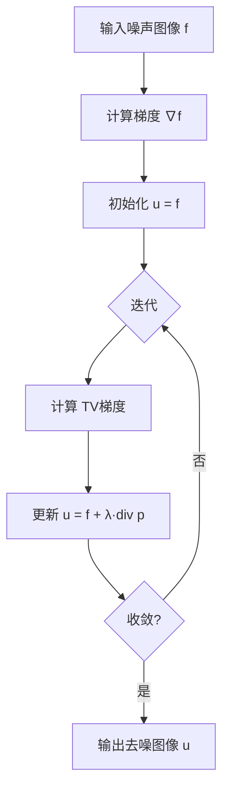

## 2. SLaT三阶段流程
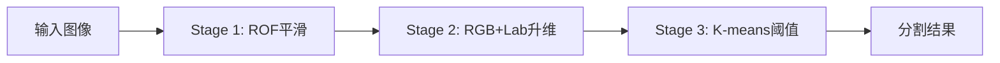

## 3. TV正则化原理
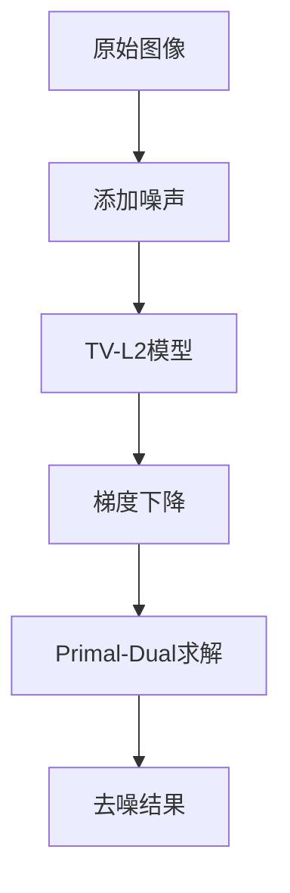

## 4. 图像分割通用流程
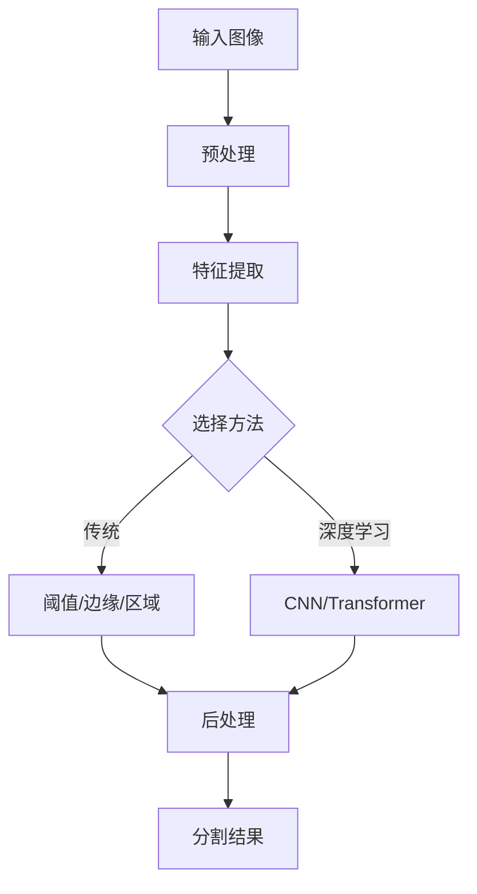

## 5. Chambolle对偶算法
```mermaid
flowchart TD
    A[初始化 p=0] --> B[计算梯度 ∇u]
    B --> C[更新 p = p + τ∇u]
    C --> D[投影 p = p/max 1, |p|]
    D --> E[更新 u = f - λdiv p]
    E --> F{收敛?}
    F -->|否| B
    F -->|是| G[输出 u]
```

## 6. 深度学习分割流程
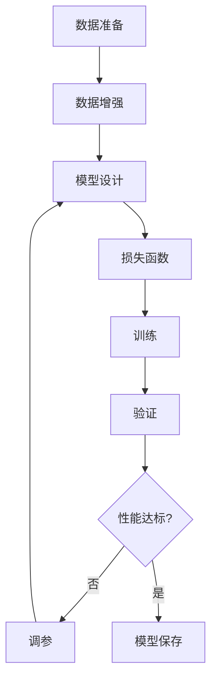

## 7. U-Net架构流程
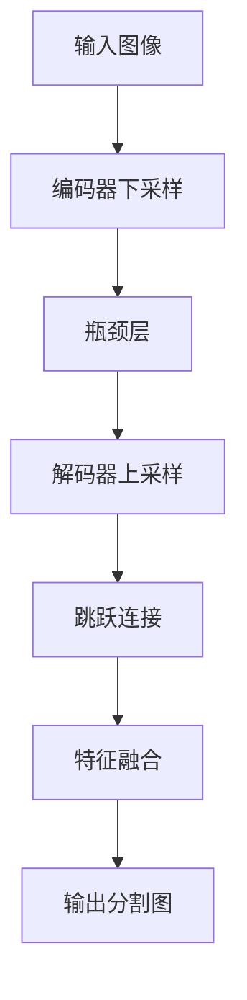

## 8. 注意力机制流程
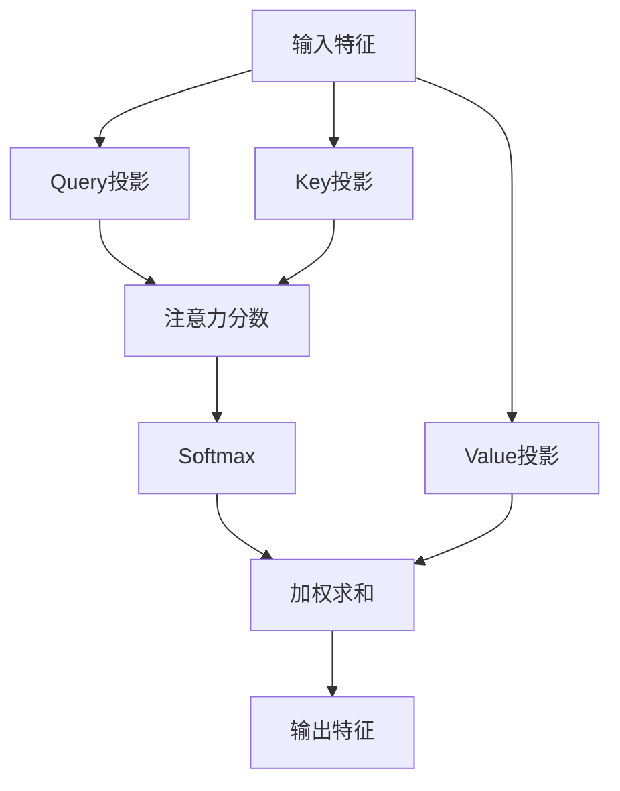

## 9. Transformer编码器
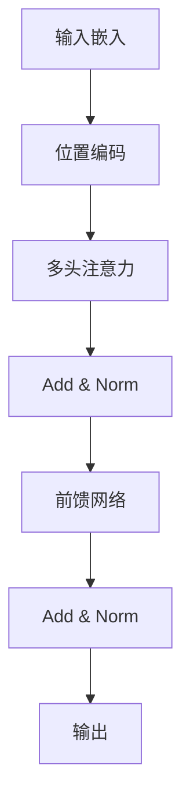

## 10. Mamba状态空间模型
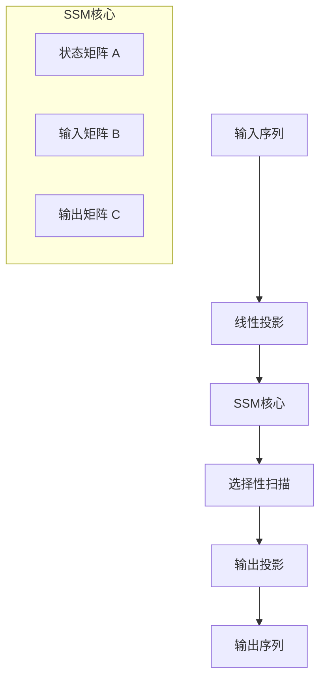

## 11. 语义分割评估流程
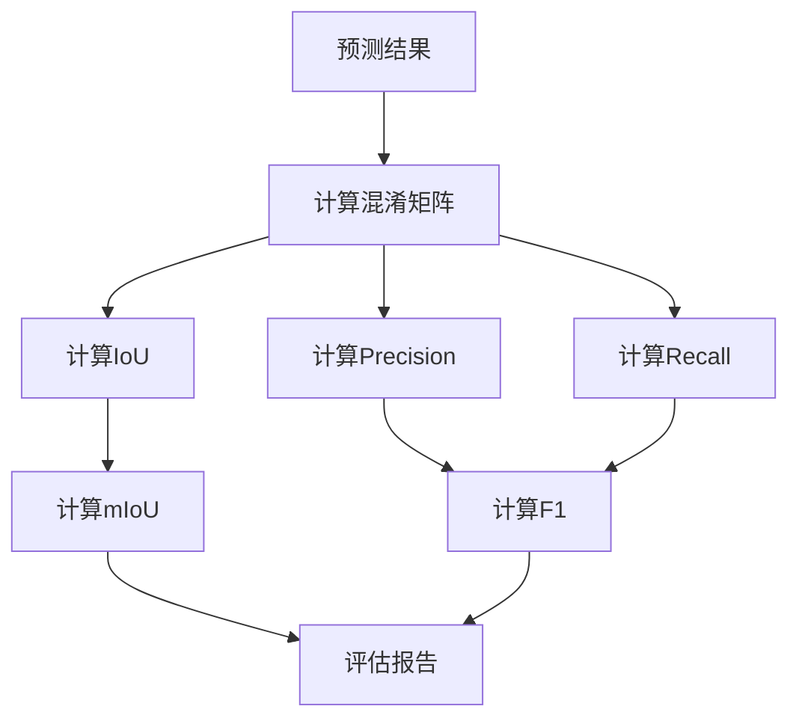

## 12. 数据增强策略
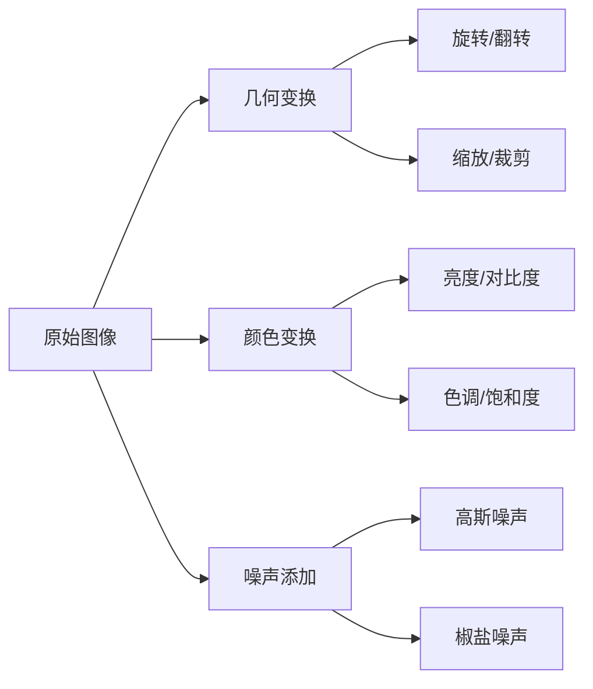

## 13. 多尺度特征融合
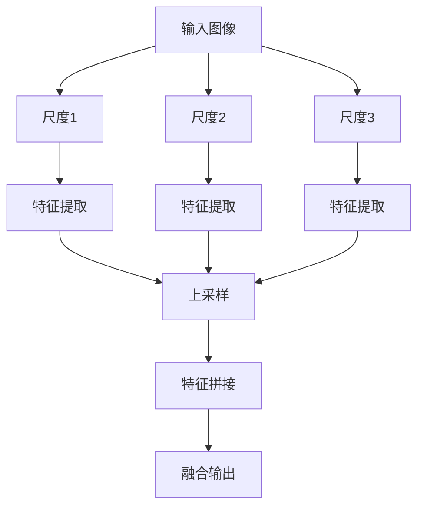

## 14. 损失函数组合
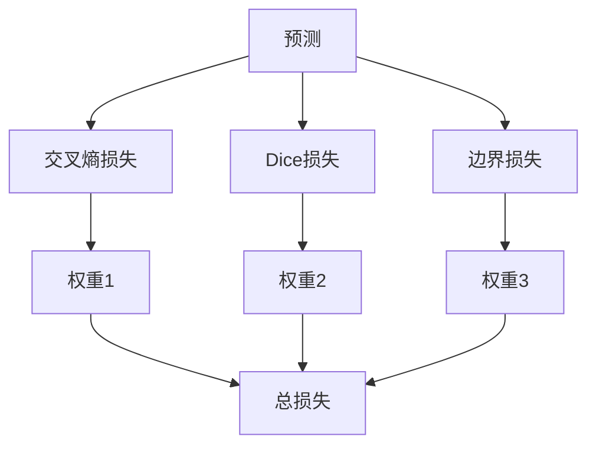

## 15. 模型推理流程
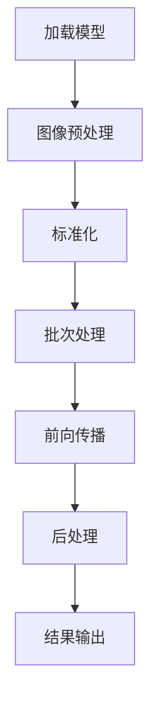

## 16. 迁移学习流程
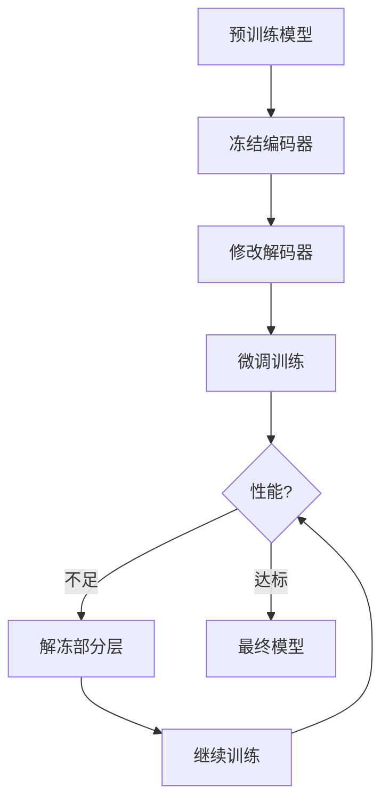

## 17. 超参数优化
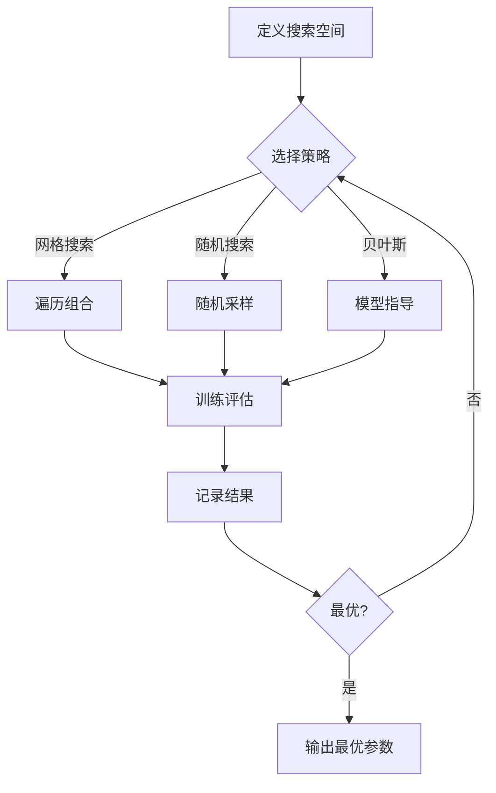

## 18. 模型压缩流程
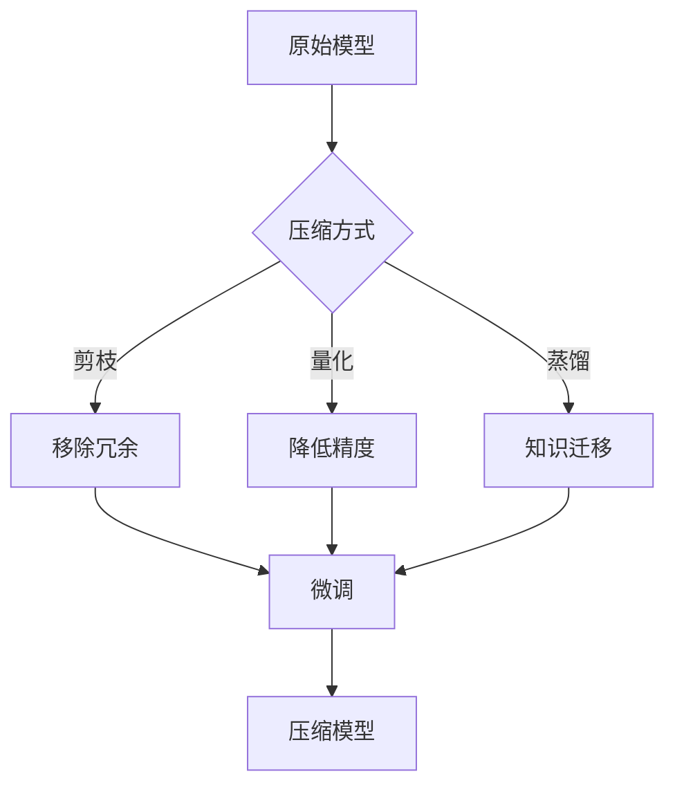

## 19. 在线学习系统
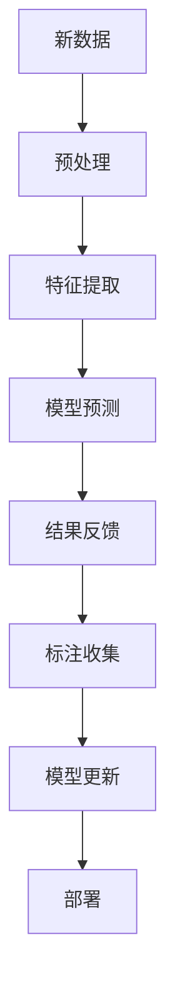

## 20. 图像分类 vs 分割
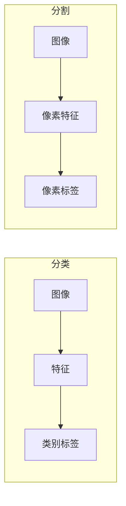
