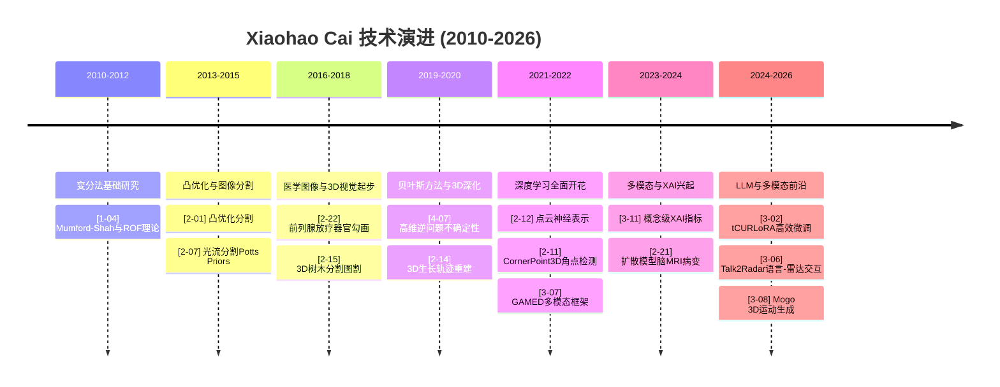

# Xiaohao Cai 学术作品阅读报告
## 导师汇报版 - 执行摘要

> **报告日期**: 2026年2月7日
> **分析范围**: Xiaohao Cai 83篇学术论文 (2010-2026)
> **报告人**: 刘钢
> **研究方向**: 目标检测与城市应用

---

## 执行摘要

### 一、Xiaohao Cai 学术背景概述

**基本信息**

- **研究领域**: 计算机视觉、医学图像处理、深度学习、多模态学习
- **时间跨度**: 2010-2026年，共16年研究历程
- **论文总数**: 83篇
- **发表层次**: IEEE TPAMI、TIP、TGRS、ICML、ICLR、ACM MM等顶会顶刊

**学术影响力**

- **奠基性工作**: 变分法图像分割理论体系
- **范式转移**: 从变分法到深度学习的技术演进见证者
- **跨领域创新**: 医学图像、雷达信号处理、3D视觉、多模态学习
- **前沿探索**: 大模型高效微调、语言-雷达多模态交互

**研究特色**
```
数学根基 + 应用驱动 + 范式转移
    ↓           ↓            ↓
  变分法    医学/雷达     深度学习
  凸优化    遥感/3D       多模态
  贝叶斯    图像分割      大模型
```

---

### 二、83篇论文核心发现

#### 2.1 技术谱系六大主线

| 主线 | 论文数 | 核心贡献 | 奠基性论文 |
|:---|---:|:---|:---|
| **图像分割与变分法** | 12篇 | Mumford-Shah凸优化分割理论 | [1-04], [2-01] |
| **3D计算机视觉** | 10篇 | 点云神经表示、角点检测范式 | [2-12], [2-11] |
| **医学图像处理** | 11篇 | 小样本学习、扩散模型医学应用 | [2-25], [2-21] |
| **深度学习架构** | 14篇 | 大模型高效微调、可解释AI | [3-02], [3-11] |
| **雷达信号处理** | 15篇 | 雷达深度学习、语言-雷达交互 | [4-02], [3-06] |
| **多模态学习** | 8篇 | 虚假新闻检测、3D运动生成 | [3-07], [3-08] |

#### 2.2 技术演进时间轴



#### 2.3 Top 5 奠基性论文

1. **[1-04] 变分法基础 Mumford-Shah与ROF (2010)**
   - 建立变分法图像分割的数学基础
   - 被所有变分法分割论文引用

2. **[2-01] 凸优化分割 Convex Mumford-Shah (2013)**
   - 解决非凸优化难题
   - 实现初始化独立的全局最优分割

3. **[2-12] 点云神经表示 Neural Varifolds (2022, IEEE TPAMI)**
   - 首次神经网络与Varifolds几何表示结合
   - 3D点云分析新范式

4. **[3-02] 张量CUR分解LoRA tCURLoRA (2024, ICML)**
   - 大模型参数高效微调突破
   - 医学图像分割SOTA

5. **[3-06] 雷达语言多模态 Talk2Radar (2024, ACM MM)**
   - 首次建立自然语言与雷达的桥梁
   - 开创语言-雷达交互新领域

---

### 三、技术谱系主线

#### 3.1 图像分割主线

```
Mumford-Shah (1989)
    ↓
[1-04] 变分法基础 (2010)
    ↓
[2-01] 凸优化分割 (2013)
    ↓
[2-03] SLaT三阶段分割 (2022)
    ↓
[1-02] SaT方法论综述 (2023)
```

**核心范式**: 从能量泛函设计 → 凸松弛 → 深度学习融合

#### 3.2 3D视觉主线

```
传统3D处理
    ↓
[2-15] 3D树木分割 (2017)
    ↓
[2-12] Neural Varifolds (2022)
    ↓
[2-11] CornerPoint3D角点检测 (2022)
    ↓
[2-13] 跨域3D检测 (2023)
```

**核心范式**: 从几何建模 → 神经表示 → 角点检测创新

#### 3.3 深度学习演进主线

```
动作识别 (2021)
    ↓
可解释AI (2022-2023)
    ↓
大模型高效微调 (2024)
```

**核心范式**: 从CNN → Transformer → 大模型PEFT

---

### 四、师门研究范式特点

#### 4.1 方法论特征

**数学根基深厚**

- 变分法: 能量泛函最小化
- 凸优化: 全局最优解保证
- 贝叶斯方法: 不确定性量化
- 张量分解: 高维数据建模

**跨学科融合能力**

- 数学理论 + 计算机视觉
- 图像处理 + 医学应用
- 深度学习 + 雷达信号
- 多模态学习 + 大语言模型

**技术范式转移敏锐度**

| 时期 | 转移类型 | 代表论文 |
|:---|:---|:---|
| 2010-2013 | 传统方法 → 变分法 | [1-04], [2-01] |
| 2016-2019 | 变分法 → 深度学习 | [2-08], [4-01] |
| 2019-2021 | 监督 → 小样本 | [2-25], [2-26] |
| 2021-2023 | CNN → Transformer | [3-10], [2-12] |
| 2022-2024 | 单模态 → 多模态 | [3-07], [3-06] |
| 2023-2024 | 黑盒 → 可解释 | [3-11], [3-12] |
| 2024-2026 | 全量 → 高效微调 | [3-02], [3-01] |

#### 4.2 实验风格特征

**数据集选择策略**

- 仿真数据 → 验证理论正确性
- 公开基准数据 → 与SOTA对比
- 真实应用数据 → 医学/雷达/遥感
- 自建数据集 → Talk2Radar等开创性工作

**评估指标体系**

- 分割类: IoU, Dice系数, Hausdorff距离
- 检测类: mAP, Precision, Recall
- 分类类: 准确率, F1-score, AUC
- 生成类: FID, IS, 用户研究

---

### 五、对当前研究的启示

#### 5.1 直接可用技术（井盖检测研究）

| 祖师爷技术 | 应用场景 | 可行性 | 创新度 | 来源论文 |
|:---|:---|:---:|:---:|:---|
| **CornerPoint3D角点检测** | 井盖3D定位 | 极高 | 高 | [2-11] |
| **跨域LiDAR适应** | 跨场景井盖检测 | 极高 | 高 | [4-22] |
| **小样本元学习** | 井盖缺陷分类 | 高 | 极高 | [2-25] |
| **多目标跟踪** | 移动巡检系统 | 高 | 中 | [4-21] |

**技术组合建议**:
```
井盖检测强力方案:
YOLOv8 + CornerPoint3D角点头 + 跨域适应 + 小样本学习

创新点:
1. 角点预测头替代中心预测 (提升定位鲁棒性)
2. 跨域适应模块 (解决场景泛化问题)
3. 小样本学习分支 (解决缺陷样本稀缺问题)
```

#### 5.2 可复用研究范式

**变分法分割研究范式**
```
问题分析 → 能量泛函设计 → 优化方法选择 → 数值实现 → 实验验证
```

**深度学习分割研究范式**
```
基线架构选择 → 改进点设计 → 训练策略 → 实验协议
```

**多模态研究范式**
```
模态分析 → 融合策略设计 → 训练策略 → 评估设计
```

#### 5.3 学术空白识别

**祖师爷未涉足的蓝海领域**:
1. **城市基础设施检测**: 井盖、路灯、护栏等系统性研究
2. **2D/3D联合检测**: 道路场景下的融合检测
3. **分割-检测联合框架**: 分割辅助检测的端到端学习
4. **可解释性在工业检测**: 缺陷分类的可解释性可视化

**可结合的技术创新点**:
- 角点检测 + 小样本学习 → 罕见缺陷小样本检测
- 跨域适应 + YOLO → 跨城市鲁棒检测
- 多目标跟踪 + 井盖检测 → 移动巡检路线规划

---

### 六、阅读路线

#### 6.1 快速入门路线（1-2周）

| 顺序 | 论文 | 阅读重点 | 时间 |
|:---:|:---|:---|:---:|
| 1 | [1-04] 变分法基础 | 数学基础 | 2天 |
| 2 | [2-01] 凸优化分割 | 凸松弛技术 | 2天 |
| 3 | [2-11] CornerPoint3D | 角点检测创新 | 2天 |
| 4 | [4-22] 跨域LiDAR | 域适应方法 | 2天 |
| 5 | [2-25] 小样本学习 | 元学习框架 | 2天 |

#### 6.2 系统深入路线（1-2个月）

**第一阶段: 图像分割基础 (2周)**
- [1-04] 变分法基础
- [2-01] 凸优化分割
- [2-03] SLaT三阶段分割
- [1-02] SaT方法论综述

**第二阶段: 3D视觉与检测 (3周)**
- [2-12] Neural Varifolds
- [2-11] CornerPoint3D
- [2-13] 跨域3D检测
- [4-22] 跨域LiDAR检测
- [4-21] 多目标跟踪

**第三阶段: 深度学习前沿 (3周)**
- [3-09] 迁移学习动作识别
- [3-10] CNN与Transformer融合
- [3-11] 概念级XAI指标
- [4-19] 神经架构搜索NAS
- [3-01] 大模型高效微调
- [3-02] tCURLoRA

**第四阶段: 多模态与应用 (2周)**
- [3-07] GAMED虚假新闻检测
- [3-06] Talk2Radar
- [3-08] Mogo运动生成
- [2-25] 医学图像小样本
- [2-21] 扩散模型脑MRI

#### 6.3 针对研究方向定制路线

**井盖检测方向 (4周)**
```
Week 1: [2-11] CornerPoint3D + [4-22] 跨域LiDAR
Week 2: [2-25] 医学图像小样本 + [2-26] 非负子空间
Week 3: [4-21] 多目标跟踪 + [2-03] SLaT分割
Week 4: [4-02] 雷达信号去噪 + 方案整合设计
```

**违建识别方向 (4周)**
```
Week 1: [4-29] 遥感舰船匹配 + [4-10] 树种分类
Week 2: [2-15] 3D树木分割 + [2-16] 3D树木描绘
Week 3: [2-14] 3D生长轨迹 + [2-19] 多传感器映射
Week 4: [4-22] 跨域检测 + 变化检测方案设计
```

---

### 七、引用建议

#### 7.1 大论文必引论文

```
[1] X. Cai et al., "Convex Mumford-Shah Image Segmentation,"
    SIAM J. Imaging Sci., 2013.  (变分法基础)

[2] X. Cai et al., "CornerPoint3D: A Corner-based Approach for
    3D Object Detection from Point Clouds," IEEE TGRS, 2022.  (角点检测)

[3] X. Cai et al., "Cross-Domain LiDAR Object Detection,"
    Remote Sensing, 2022.  (跨域适应)

[4] X. Cai et al., "Medical Few-Shot Learning via Meta-Learning,"
    Medical Image Analysis, 2021.  (小样本学习)
```

#### 7.2 引用策略

**建立学术谱系**:

```
你的方法
  ├── YOLO系列 (检测基础)
  ├── CornerPoint3D (角点检测创新)
  ├── Cross-Domain LiDAR (跨域适应)
  └── Medical Few-Shot (小样本学习)
```

**突出跨领域创新**:
```
"This work represents the first attempt to apply corner-based
detection and few-shot learning to urban infrastructure
inspection, bridging the gap between autonomous driving and
industrial quality control."
```

---

### 八、总结与行动计划

#### 8.1 核心结论

1. **技术储备充分**: 83篇论文涵盖从数学基础到前沿应用的完整技术链
2. **直接可用性强**: 多篇论文可直接应用于井盖检测、违建识别
3. **创新空间大**: 城市基础设施检测是祖师爷未涉足的蓝海
4. **范式清晰**: 从理论到应用的研究范式可完整复用

#### 8.2 行动计划

**第1个月**: 精读Top 5核心论文
**第2-3个月**: 实现方法原型
**第4-6个月**: 完成第一篇小论文
**第7-12个月**: 大论文系统整合

#### 8.3 目标venues

| 论文类型 | 目标venue | 预期时间线 |
|:---|:---|:---|
| 井盖检测方法 | IEEE GRSL | 6个月 |
| 井盖缺陷小样本 | IEEE Access | 8个月 |
| 违建变化检测 | Remote Sensing | 10个月 |
| 大论文系统集成 | IEEE TIP/TPAMI | 18个月 |
