# Xiaohao Cai 学术遗产阅读报告
## 个人研读版 - 技术简报

> **报告日期**: 2026年2月7日
> **分析范围**: Xiaohao Cai 83篇学术论文 (2010-2026)
> **阅读目标**: 深度技术分析与可复用组件提取

---

## 目录

1. [完整论文分类体系](#1-完整论文分类体系)
2. [技术演进深度分析](#2-技术演进深度分析)
3. [Top 20核心论文详解](#3-top-20核心论文详解)
4. [可复用技术组件库](#4-可复用技术组件库)
5. [阅读打卡表](#5-阅读打卡表)

---

## 1. 完整论文分类体系

### 1.1 按研究阶段分类

#### Phase 1: 基础理论与方法 (7篇)

| ID | 标题 | 年份 | 期刊 | 核心贡献 |
|:---|:---|:---:|:---|:---|
| [1-01] | 深度学习架构综述 | 2023 | Survey | CNNs/RNNs/Transformers综述 |
| [1-02] | 分割方法论总览 SaT | 2023 | Springer | SaT分割方法论系统总结 |
| [1-03] | 数据增强基础 | 2021 | IEEE Access | 数据增强综述 |
| [1-04] | 变分法基础 Mumford-Shah | 2010 | Book Chapter | **奠基性**: 变分法数学基础 |
| [1-05] | 高维数据分类 | 2018 | PR | Two-Stage分类 |
| [1-06] | 可解释AI综述 | 2023 | Information Fusion | XAI综述 |
| [1-07] | 动作识别架构综述 | 2022 | TCSVT | 动作识别综述补充 |

**阅读优先级**: [1-04] > [1-02] > [1-06] > 其他

---

#### Phase 2: 核心技术突破 (31篇)

##### 2.1 图像分割与变分法 (7篇)

| ID | 标题 | 年份 | 期刊 | 核心贡献 |
|:---|:---|:---:|:---|:---|
| [2-01] | 凸优化分割 | 2013 | SIAM JIS | **奠基性**: 凸松弛技术 |
| [2-02] | 多类分割迭代ROF | 2017 | JMIV | 迭代ROF多类分割 |
| [2-03] | SLaT三阶段分割 | 2022 | MedIA | **重要**: SaT方法论核心 |
| [2-04] | 分割与恢复联合 | 2015 | Inverse Problems | 分割-恢复联合模型 |
| [2-05] | 语义比例分割 | 2021 | IEEE TIP | 语义比例分割方法 |
| [2-06] | 可见表面检测 | 2016 | SIAM JIS | 立体视觉可见表面 |
| [2-07] | 光流分割 Potts | 2013 | SIAM JIS | Potts先验光流分割 |

**阅读优先级**: [2-01] > [2-03] > [2-05] > 其他

##### 2.2 医学图像处理 (10篇)

| ID | 标题 | 年份 | 期刊 | 核心贡献 |
|:---|:---|:---:|:---|:---|
| [2-20] | 放疗直肠分割 | 2021 | Medical Physics | 直肠分割深度学习 |
| [2-21] | 扩散模型脑MRI | 2023 | MedIA | **前沿**: 扩散模型医学应用 |
| [2-22] | 前列腺放疗器官 | 2016 | PMB | 放疗器官勾画 |
| [2-23] | 直肠轮廓精度 | 2018 | Radiother Oncol | 精度分析 |
| [2-24] | VoxTox研究计划 | 2016 | Lancet Oncol | 临床研究计划 |
| [2-25] | 医学图像小样本 | 2021 | MedIA | **重要**: 小样本学习 |
| [2-26] | 非负子空间小样本 | 2022 | IEEE TMI | 子空间小样本方法 |
| [2-27] | 临床变量医学分类 | 2019 | Sci Rep | 临床变量分类 |
| [2-28] | 医学报告生成 | 2022 | Artif Intell Med | 多模态报告生成 |
| [2-29] | 中心体分割网络 | 2021 | MedIA | CenSegNet高通量分割 |

**阅读优先级**: [2-25] > [2-21] > [2-29] > 其他

##### 2.3 3D计算机视觉 (10篇)

| ID | 标题 | 年份 | 期刊 | 核心贡献 |
|:---|:---|:---:|:---|:---|
| [2-11] | 3D检测新范式 | 2022 | IEEE TGRS | **重要**: CornerPoint3D |
| [2-12] | 点云神经表示 | 2022 | IEEE TPAMI | **奠基性**: Neural Varifolds |
| [2-13] | 跨域3D检测 | 2023 | IEEE TNNLS | 跨域3D检测理论 |
| [2-14] | 3D生长轨迹 | 2020 | IEEE TGRS | 植物表型3D重建 |
| [2-15] | 3D树木分割图割 | 2017 | IEEE TGRS | 3D树木图割分割 |
| [2-16] | 3D树木描绘 | 2018 | Remote Sensing | 3D树木描绘算法 |
| [2-17] | 形状签名Krawtchouk | 2018 | IEEE Access | 3DKMI形状分析 |
| [2-18] | 3D方向场变换 | 2019 | IEEE TIP | 3D方向场变换 |
| [2-19] | 多传感器树木映射 | 2020 | ISPRS | 多传感器融合 |
| [2-31] | 点云神经表示补充 | 2023 | arXiv | Neural Varifolds补充 |

**阅读优先级**: [2-12] > [2-11] > [2-13] > 其他

##### 2.4 其他图像处理 (4篇)

| ID | 标题 | 年份 | 期刊 | 核心贡献 |
|:---|:---|:---:|:---|:---|
| [2-08] | 小波框架血管分割 | 2016 | Neurocomputing | 小波框架血管分割 |
| [2-09] | 框架分割管状结构 | 2016 | IPOL | 框架理论管状分割 |
| [2-10] | 生物孔隙变分分割 | 2016 | Frontiers Plant Sci | 生物孔隙分割 |
| [2-30] | 高效变分分类 | 2015 | SVM | 变分分类方法 |

---

#### Phase 3: 深度学习与多模态 (13篇)

##### 3.1 大模型与高效微调 (2篇)

| ID | 标题 | 年份 | 期刊 | 核心贡献 |
|:---|:---|:---:|:---|:---|
| [3-01] | 大模型高效微调 | 2024 | EMNLP | LLM高效微调方法 |
| [3-02] | 张量CUR分解LoRA | 2024 | ICML | **重要**: tCURLoRA |

##### 3.2 图神经网络 (1篇)

| ID | 标题 | 年份 | 期刊 | 核心贡献 |
|:---|:---|:---:|:---|:---|
| [3-03] | 自监督图神经网络 | 2023 | TKDD | LL4G图学习 |

##### 3.3 张量分解 (2篇)

| ID | 标题 | 年份 | 期刊 | 核心贡献 |
|:---|:---|:---:|:---|:---|
| [3-04] | 低秩Tucker近似 | 2021 | SIAM J MDS | Sketching Tucker |
| [3-05] | 大规模张量分解 | 2022 | SIAM J MA | Two-Sided Sketching |

##### 3.4 多模态学习 (3篇)

| ID | 标题 | 年份 | 期刊 | 核心贡献 |
|:---|:---|:---:|:---|:---|
| [3-06] | 雷达语言多模态 | 2024 | ACM MM | **重要**: Talk2Radar |
| [3-07] | 多模态虚假新闻 | 2022 | ACM MM | **重要**: GAMED框架 |
| [3-13] | GAMED多专家解耦 | 2024 | arXiv | GAMED扩展 |

##### 3.5 3D运动生成 (1篇)

| ID | 标题 | 年份 | 期刊 | 核心贡献 |
|:---|:---|:---:|:---|:---|
| [3-08] | 3D人体运动生成 | 2024 | ICLR | **前沿**: Mogo运动生成 |

##### 3.6 动作识别 (2篇)

| ID | 标题 | 年份 | 期刊 | 核心贡献 |
|:---|:---|:---:|:---|:---|
| [3-09] | 迁移学习动作识别 | 2021 | IEEE TIP | TransNet迁移学习 |
| [3-10] | CNN与Transformer动作 | 2022 | IEEE TNNLS | CNN-ViT融合 |

##### 3.7 可解释AI (2篇)

| ID | 标题 | 年份 | 期刊 | 核心贡献 |
|:---|:---|:---:|:---|:---|
| [3-11] | 概念级XAI指标 | 2023 | IEEE TPAMI | **重要**: 概念XAI |
| [3-12] | 多层次XAI解释 | 2022 | Information Fusion | 多层解释框架 |

**阅读优先级**: [3-02] > [3-06] > [3-11] > [3-07] > [3-08] > 其他

---

#### Phase 4: 应用与扩展 (32篇)

##### 4.1 雷达信号处理 (10篇)

| ID | 标题 | 年份 | 期刊 | 核心贡献 |
|:---|:---|:---:|:---|:---|
| [4-01] | 雷达工作模式识别 | 2019 | IEEE GRSL | 雷达模式深度学习 |
| [4-02] | 雷达信号去噪DNCNet | 2022 | Remote Sensing | **重要**: DNCNet去噪 |
| [4-03] | ISAR卫星特征 | 2021 | IEEE Access | ISAR目标识别 |

##### 4.2 无线电干涉测量 (5篇)

| ID | 标题 | 年份 | 期刊 | 核心贡献 |
|:---|:---|:---:|:---|:---|
| [4-04] | 无线电干涉不确定性I | 2012 | IEEE TIP | **奠基性**: 不确定性量化 |
| [4-05] | 在线无线电干涉成像 | 2013 | SPIE | 在线成像算法 |
| [4-06] | 分布式无线电干涉优化 | 2014 | SIAM JIS | 分布式优化 |
| [4-28] | 离线与在线重建 | 2015 | SIAM JIS | 离线在线算法 |

##### 4.3 贝叶斯方法 (7篇)

| ID | 标题 | 年份 | 期刊 | 核心贡献 |
|:---|:---|:---:|:---|:---|
| [4-07] | 高维逆问题不确定性 | 2017 | Bayesian Analysis | **重要**: 贝叶斯框架 |
| [4-08] | 近端嵌套采样 | 2019 | SIAM JIS | 近端嵌套采样 |
| [4-09] | 数据驱动先验 | 2020 | SIAM JIS | 数据驱动先验 |
| [4-30] | 稀疏贝叶斯假设检验 | 2019 | SIAM JIS | 假设检验 |
| [4-31] | 稀疏贝叶斯可信区间 | 2019 | SIAM JIS | 可信区间 |
| [4-32] | 稀疏贝叶斯峰值统计 | 2020 | SIAM JIS | 峰值统计 |

##### 4.4 遥感与3D (5篇)

| ID | 标题 | 年份 | 期刊 | 核心贡献 |
|:---|:---|:---:|:---|:---|
| [4-10] | 多传感器树种分类 | 2019 | Remote Sensing | 树种分类 |
| [4-22] | 跨域LiDAR检测 | 2022 | Remote Sensing | **重要**: 跨域检测 |
| [4-29] | 遥感图像舰船匹配 | 2021 | IEEE GRSL | 遥感目标匹配 |

##### 4.5 其他应用 (5篇)

| ID | 标题 | 年份 | 期刊 | 核心贡献 |
|:---|:---|:---:|:---|:---|
| [4-11] | 非参数图像配准 | 2013 | SIAM JIS | 非参数配准 |
| [4-12] | 球面小波分割 | 2014 | SIAM JIS | 球面小波 |
| [4-19] | 神经架构搜索NAS | 2021 | IEEE TPAMI | **重要**: Balanced NAS |
| [4-20] | NAS在SEI应用 | 2022 | IEEE Access | NAS雷达应用 |
| [4-21] | 多目标跟踪 | 2020 | IEEE TIP | **重要**: GRASPTrack |

---

### 1.2 按优先级分类

#### Priority 5: 必读奠基性论文 (15篇)

```
变分法基础: [1-04], [2-01]
图像分割: [2-03], [1-02]
3D视觉: [2-12], [2-11]
医学图像: [2-25], [2-21]
深度学习: [3-02], [3-06], [3-11], [3-07], [3-08]
雷达: [4-02]
NAS: [4-19]
```

#### Priority 4: 重要扩展论文 (20篇)

```
图像分割: [2-02], [2-04], [2-05], [2-06], [2-07]
3D视觉: [2-13], [2-31], [2-18]
医学图像: [2-20], [2-26], [2-29]
深度学习: [3-04], [3-05], [3-09], [3-10], [3-12], [3-13]
雷达: [4-04], [4-07], [4-08], [4-09], [4-30], [4-31], [4-32]
其他: [4-21], [4-22]
```

#### Priority 3-1: 扩展阅读 (48篇)

---

## 2. 技术演进深度分析

### 2.1 技术谱系图谱

```mermaid
graph TB
    Root[Xiaohao Cai 技术谱系 2010-2026]

    %% 主线1: 图像分割与变分法
    Root --> Seg[图像分割与变分法]
    Seg --> SegFund[变分法基础 2010-2015]
    Seg --> SegDeep[深度学习分割 2016-2023]
    Seg --> SegSaT[SaT方法论 2020-2023]

    %% 主线2: 3D计算机视觉
    Root --> Vision3D[3D计算机视觉]
    Vision3D --> Tree3D[3D树木分析 2017-2020]
    Vision3D --> PointCloud[点云神经网络 2022-2023]
    Vision3D --> Detection3D[3D目标检测 2022-2023]

    %% 主线3: 医学图像处理
    Root --> Medical[医学图像处理]
    Medical --> Radiotherapy[放疗器官分割 2016-2022]
    Medical --> FewShot[小样本学习 2021-2023]
    Medical --> Diffusion[扩散模型 2023-2026]

    %% 主线4: 深度学习架构
    Root --> DLArch[深度学习架构]
    DLArch --> ActionRec[动作识别 2021-2022]
    DLArch --> NAS[神经架构搜索 2021-2022]
    DLArch --> XAI[可解释AI 2022-2024]
    DLArch --> LLM[大模型高效微调 2024-2026]

    %% 主线5: 雷达信号处理
    Root --> Radar[雷达信号处理]
    Radar --> RadioInterfer[无线电干涉 2012-2020]
    Radar --> Bayesian[贝叶斯不确定性 2017-2020]
    Radar --> RadarDeep[雷达深度学习 2019-2024]
    Radar --> Talk2Radar[语言-雷达多模态 2024-2026]

    %% 主线6: 多模态学习
    Root --> MultiModal[多模态学习]
    MultiModal --> GAMED[虚假新闻检测 2022-2024]
    MultiModal --> Talk2Radar2[语言-雷达 2024]
    MultiModal --> MotionGen[3D运动生成 2024]

    style SegFund fill:#ff6b6b,color:#fff
    style PointCloud fill:#4ecdc4,color:#fff
    style LLM fill:#ffe66d
    style Talk2Radar fill:#ffe66d
    style Diffusion fill:#ffe66d
```



### 2.2 关键技术转移点

| 转移点 | 时期 | 代表论文 | 技术影响 |
|:---|:---|:---|:---|
| 变分法基础 | 2010-2013 | [1-04], [2-01] | 建立数学基础 |
| 2D→3D视觉 | 2017-2020 | [2-15], [2-12] | 维度拓展 |
| 深度学习融合 | 2016-2019 | [2-08], [4-01] | 方法革新 |
| 小样本学习 | 2019-2021 | [2-25], [2-26] | 数据效率 |
| Transformer | 2021-2023 | [3-10], [2-12] | 架构升级 |
| 多模态融合 | 2022-2024 | [3-07], [3-06] | 跨模态学习 |
| 可解释AI | 2022-2024 | [3-11], [3-12] | 透明性增强 |
| 高效微调 | 2024-2026 | [3-02], [3-01] | 参数效率 |

### 2.3 方法论演变


---

## 3. Top 20核心论文详解

### 3.1 第一梯队: 奠基性工作 (5篇)

#### [1-04] 变分法基础 Mumford-Shah与ROF (2010)

**论文信息**
- **期刊**: Book Chapter
- **分类**: [奠基性] [方法源流]
- **重要性**: ★★★★★

**核心内容**
```
Mumford-Shah能量泛函:
E(u,Γ) = ∫(u-f)²dx + μ∫|∇u|²dx + ν·|Γ|

其中:
- u: 分割结果图像
- f: 原始图像
- Γ: 分割边界
- μ, ν: 正则化参数

ROF (Rudin-Osher-Fatemi) 模型:
E(u) = ∫(u-f)²dx + λ∫|∇u|dx
```

**核心贡献**
1. 系统阐述变分法图像分割的数学基础
2. 建立Mumford-Shah与ROF模型的理论联系
3. 为后续凸优化分割工作奠定基础

**可复用组件**
- 能量泛函设计模板
- 变分推导流程
- 梯度下降优化算法

**阅读建议**: 重点阅读第2-3章，理解能量泛函设计原理

---

#### [2-01] 凸优化分割 Convex Mumford-Shah (2013)

**论文信息**
- **期刊**: SIAM Journal on Imaging Sciences
- **分类**: [奠基性] [高被引]
- **重要性**: ★★★★★

**核心内容**
```
凸松弛策略:
原始问题 (非凸):
min E(u) s.t. u ∈ {0,1}

凸松弛:
min E_convex(v) s.t. v ∈ [0,1]

Split Bregman迭代:
1. 引入辅助变量 d = ∇u
2. 交替优化 u 和 d
3. Bregman迭代加速收敛
```

**核心贡献**
1. 解决Mumford-Shah模型的非凸优化难题
2. 实现初始化独立的全局最优分割
3. Split Bregman算法高效求解

**可复用组件**
```
凸优化分割模板:
1. 定义非凸能量泛函 E(u)
2. 引入松弛变量 v
3. 构造凸能量泛函 E_convex(u,v)
4. Split Bregman迭代求解
5. 阈值处理获得最终分割
```

**阅读建议**: 重点理解凸松弛技术和Split Bregman算法

---

#### [2-12] 点云神经表示 Neural Varifolds (2022)

**论文信息**
- **期刊**: IEEE TPAMI
- **分类**: [奠基性] [范式转移] [高被引]
- **重要性**: ★★★★★

**核心内容**
```
Neural Varifolds表示:
1. 点云编码器: f: P → R^d
2. Varifolds度量: ω(V1, V2)
3. 端到端训练: min L(f, ω)

Varifolds距离:
d_V(P1, P2) = ||V1||² + ||V2||² - 2⟨V1, V2⟩_K

其中K是核函数
```

**核心贡献**
1. 首次神经网络与Varifolds几何表示结合
2. 点云神经表示学习框架
3. 建立3D点云分析新范式

**可复用组件**
- 神经表示学习架构
- Varifolds相似性度量
- 端到端训练策略

**阅读建议**: 重点理解Varifolds表示和神经编码器设计

---

#### [3-02] 张量CUR分解LoRA tCURLoRA (2024)

**论文信息**
- **期刊**: ICML 2024
- **分类**: [范式转移] [高被引潜力]
- **重要性**: ★★★★★

**核心内容**
```
tCURLoRA算法:
1. 将权重reshape为张量 W ∈ R^{n1×n2×n3×n4}
2. 执行CUR分解: W ≈ C × U × R
3. 只微调核心张量 U
4. 前向传播: W' = W + α(C × U' × R)

相比LoRA的优势:
- LoRA: W ≈ AB (矩阵分解)
- tCURLoRA: W ≈ CUR (张量分解)
- 更好建模高维结构
```

**核心贡献**
1. 张量CUR分解用于参数高效微调
2. 相比LoRA更好建模高维结构
3. 医学图像分割任务SOTA

**可复用组件**
```python
tCURLoRA核心算法:
1. W_reshaped = W.reshape(n1, n2, n3, n4)
2. C, U, R = tucker_cur(W_reshaped, ranks)
3. U_finetune = nn.Parameter(U.clone())
4. W_delta = C @ U_finetune @ R
5. W_new = W + alpha * W_delta.reshape_as(W)
```

**阅读建议**: 重点理解CUR分解和LoRA的区别

---

#### [3-06] 雷达语言多模态 Talk2Radar (2024)

**论文信息**
- **期刊**: ACM MM 2024 (Oral)
- **分类**: [奠基性] [范式转移] [高被引潜力]
- **重要性**: ★★★★★

**核心内容**
```
Talk2Radar框架:
1. 雷达编码器: E_r: R → R^d
2. 语言编码器: E_l: L → R^d
3. 对比学习: L = InfoNCE(E_r(r), E_l(l))
4. 零样本检索: sim(r, l) = cos(E_r(r), E_l(l))

开创性贡献:
- 首个语言-雷达数据集
- 零样本跨模态检索
- 语言引导的雷达生成
```

**核心贡献**
1. **开创性**: 首次建立语言-雷达桥梁
2. 创建首个语言-雷达多模态数据集
3. 端到端语言-雷达交互框架

**可复用组件**
- 跨模态对比学习框架
- 零样本检索评估协议
- 多模态数据集构建规范

**阅读建议**: 重点理解跨模态对齐和对比学习

---

### 3.2 第二梯队: 重要扩展 (15篇)

#### [2-11] CornerPoint3D: 3D检测新范式 (2022)

**论文信息**
- **期刊**: IEEE TGRS
- **分类**: [范式转移] [方法创新]
- **重要性**: ★★★★★

**核心创新**
```
传统方法: 预测目标中心 (x, y, z, w, h, l, θ)
问题: 中心点易被遮挡

CornerPoint3D: 预测最近角点
优势:
1. 角点更稳定 (位于表面)
2. 4角点投票 (鲁棒性强)
3. EdgeHead模块 (边缘关注)
```

**对井盖检测的启示**
```
应用场景:
传统: 预测井盖中心 → 易受遮挡影响
创新: 预测井盖角点 → 4角点确定位置，鲁棒性强
```

---

#### [2-25] 医学图像小样本学习 (2021)

**论文信息**
- **期刊**: Medical Image Analysis
- **分类**: [范式转移] [奠基性]
- **重要性**: ★★★★☆

**核心内容**
```
元学习框架:
1. Episode训练: 每个episode包含N-way K-shot
2. 支持集-查询集划分
3. 度量学习: 原型网络
4. 快速适应: 梯度下降微调

应用到井盖缺陷:
- 基类: 正常、裂纹、变形
- 新类: 腐蚀、缺失 (5-shot)
```

---

#### [3-11] 概念级XAI指标 (2023)

**论文信息**
- **期刊**: IEEE TPAMI
- **分类**: [范式转移] [奠基性]
- **重要性**: ★★★★★

**核心内容**
```
概念级XAI框架:
1. Concept Bottleneck: 中间层概念
2. TCAV (Testing with Concept Activation Vectors)
3. 概念保真度: CF = Σ_c relevance(y, c) × relevance(c, x)

应用: 井盖缺陷可解释性
- 概念: 裂纹、变形、腐蚀
- 可视化: 每个概念的激活程度
```

---

#### 其他重要论文速览

| ID | 核心贡献 | 应用方向 |
|:---|:---|:---|
| [2-03] | SLaT三阶段分割 | 分割方法论 |
| [3-07] | GAMED多模态框架 | 虚假新闻检测 |
| [3-08] | Mogo运动生成 | 3D运动合成 |
| [4-22] | 跨域LiDAR检测 | 跨域适应 |
| [2-21] | 扩散模型脑MRI | 医学图像生成 |

---

## 4. 可复用技术组件库

### 4.1 变分法组件

#### 能量泛函模板

```python
class EnergyFunctional:
    """通用能量泛函设计模板"""

    def __init__(self, fidelity_weight=1.0, reg_weight=0.1):
        self.lambda_f = fidelity_weight
        self.lambda_r = reg_weight

    def mumford_shah(self, u, f):
        """Mumford-Shah泛函"""
        data_term = torch.sum((u - f)**2)
        reg_term = torch.sum(torch.norm(torch.gradient(u), dim=-1))
        return self.lambda_f * data_term + self.lambda_r * reg_term

    def rof(self, u, f):
        """ROF泛函"""
        data_term = torch.sum((u - f)**2)
        reg_term = torch.sum(torch.sqrt(torch.gradient(u)**2 + 1e-6))
        return self.lambda_f * data_term + self.lambda_r * reg_term
```

#### Split Bregman迭代

```python
def split_bregman_optimize(image, max_iter=100, tol=1e-4):
    """Split Bregman算法模板"""
    u = image.clone()
    d_x = d_y = torch.zeros_like(image)
    b_x = b_y = torch.zeros_like(image)

    for _ in range(max_iter):
        # u子问题
        u = solve_u_subproblem(image, d_x, d_y, b_x, b_y)
        # d子问题
        d_x = shrinkage(torch.gradient(u, dim=1) + b_x)
        d_y = shrinkage(torch.gradient(u, dim=0) + b_y)
        # Bregman更新
        b_x += torch.gradient(u, dim=1) - d_x
        b_y += torch.gradient(u, dim=0) - d_y
        if convergence_check(u, prev_u, tol):
            break
    return u
```

---

### 4.2 深度学习组件

#### U-Net模板

```python
class UNetBase(nn.Module):
    """标准U-Net架构模板"""
    def __init__(self, in_channels=3, num_classes=2, base_channels=64):
        super().__init__()
        # Encoder
        self.enc1 = DoubleConv(in_channels, base_channels)
        self.enc2 = DoubleConv(base_channels, base_channels*2)
        self.enc3 = DoubleConv(base_channels*2, base_channels*4)
        self.enc4 = DoubleConv(base_channels*4, base_channels*8)
        # Bottleneck
        self.bottleneck = DoubleConv(base_channels*8, base_channels*16)
        # Decoder
        self.dec4 = UpConv(base_channels*16, base_channels*8)
        self.dec3 = UpConv(base_channels*8, base_channels*4)
        self.dec2 = UpConv(base_channels*4, base_channels*2)
        self.dec1 = UpConv(base_channels*2, base_channels)
        # Output
        self.final = nn.Conv2d(base_channels, num_classes, 1)
        self.pool = nn.MaxPool2d(2)
```

#### 组合损失函数

```python
class CombinedLoss(nn.Module):
    """组合损失函数模板"""
    def __init__(self, dice_weight=0.5, focal_weight=0.5):
        super().__init__()
        self.dice = DiceLoss()
        self.focal = FocalLoss()

    def forward(self, pred, target):
        return self.dice(pred, target) + self.focal(pred, target)
```

---

### 4.3 多模态融合组件

#### 跨模态注意力

```python
class CrossModalAttention(nn.Module):
    """跨模态注意力融合模板"""
    def __init__(self, embed_dim, num_heads=8):
        super().__init__()
        self.multihead_attn = nn.MultiheadAttention(embed_dim, num_heads)
        self.norm = nn.LayerNorm(embed_dim)

    def forward(self, query_modal, key_modal, value_modal):
        attn_out, _ = self.multihead_attn(query_modal, key_modal, value_modal)
        return self.norm(query_modal + attn_out)
```

#### 对比学习框架

```python
class ContrastiveLearning(nn.Module):
    """跨模态对比学习模板"""
    def __init__(self, embed_dim, temperature=0.07):
        super().__init__()
        self.temperature = temperature
        self.encoder_a = EncoderA(embed_dim)
        self.encoder_b = EncoderB(embed_dim)

    def contrastive_loss(self, z_a, z_b):
        """InfoNCE损失"""
        logits_ab = torch.matmul(z_a, z_b.T) / self.temperature
        labels = torch.arange(z_a.size(0))
        return F.cross_entropy(logits_ab, labels)
```

---

### 4.4 小样本学习组件

#### 元学习框架

```python
class MAML(nn.Module):
    """MAML元学习模板"""
    def __init__(self, model, inner_lr=0.01, meta_lr=0.001):
        super().__init__()
        self.model = model
        self.inner_lr = inner_lr
        self.meta_optimizer = torch.optim.Adam(model.parameters(), lr=meta_lr)

    def inner_loop(self, support_x, support_y, num_steps=5):
        """内层循环: 快速适应"""
        fast_weights = [p.clone() for p in self.model.parameters()]
        for _ in range(num_steps):
            logits = self.model.functional_forward(support_x, fast_weights)
            loss = F.cross_entropy(logits, support_y)
            grads = torch.autograd.grad(loss, fast_weights, create_graph=True)
            fast_weights = [w - self.inner_lr * g for w, g in zip(fast_weights, grads)]
        return fast_weights
```

---

### 4.5 3D视觉组件

#### 点云编码器

```python
class PointCloudEncoder(nn.Module):
    """点云神经表示编码器"""
    def __init__(self, input_dim=3, embed_dim=256, num_layers=4):
        super().__init__()
        self.point_features = nn.Sequential(
            nn.Linear(input_dim, 64),
            nn.ReLU(),
            nn.Linear(64, 128),
            nn.ReLU(),
            nn.Linear(128, embed_dim)
        )
        self.transformer_layers = nn.ModuleList([
            nn.TransformerEncoderLayer(d_model=embed_dim, nhead=8)
            for _ in range(num_layers)
        ])
        self.global_pool = nn.AdaptiveAvgPool1d(1)
```

---

## 5. 阅读打卡表

### 5.1 快速入门打卡表 (1-2周)

| 日期 | 论文ID | 标题 | 完成度 | 笔记 |
|:---|:---|:---|:---:|:---|
| | [1-04] | 变分法基础 | ___ | |
| | [2-01] | 凸优化分割 | ___ | |
| | [2-11] | CornerPoint3D | ___ | |
| | [4-22] | 跨域LiDAR | ___ | |
| | [2-25] | 小样本学习 | ___ | |

### 5.2 系统深入打卡表 (1-2个月)

#### 第一阶段: 图像分割基础
| 日期 | 论文ID | 标题 | 完成度 | 核心收获 |
|:---|:---|:---|:---:|:---|
| | [1-04] | 变分法基础 | ___ | |
| | [2-01] | 凸优化分割 | ___ | |
| | [2-03] | SLaT三阶段 | ___ | |
| | [1-02] | SaT综述 | ___ | |

#### 第二阶段: 3D视觉与检测
| 日期 | 论文ID | 标题 | 完成度 | 核心收获 |
|:---|:---|:---|:---:|:---|
| | [2-12] | Neural Varifolds | ___ | |
| | [2-11] | CornerPoint3D | ___ | |
| | [2-13] | 跨域3D检测 | ___ | |
| | [4-22] | 跨域LiDAR | ___ | |
| | [4-21] | 多目标跟踪 | ___ | |

#### 第三阶段: 深度学习前沿
| 日期 | 论文ID | 标题 | 完成度 | 核心收获 |
|:---|:---|:---|:---:|:---|
| | [3-09] | 迁移学习动作 | ___ | |
| | [3-10] | CNN-ViT融合 | ___ | |
| | [3-11] | 概念级XAI | ___ | |
| | [4-19] | Balanced NAS | ___ | |
| | [3-01] | LLM微调 | ___ | |
| | [3-02] | tCURLoRA | ___ | |

#### 第四阶段: 多模态与应用
| 日期 | 论文ID | 标题 | 完成度 | 核心收获 |
|:---|:---|:---|:---:|:---|
| | [3-07] | GAMED | ___ | |
| | [3-06] | Talk2Radar | ___ | |
| | [3-08] | Mogo运动 | ___ | |
| | [2-25] | 医学小样本 | ___ | |
| | [2-21] | 扩散模型MRI | ___ | |

---

**报告完成日期**: 2026年2月7日
**版本**: 1.0
**生成工具**: Claude Code Technical Brief Generator
