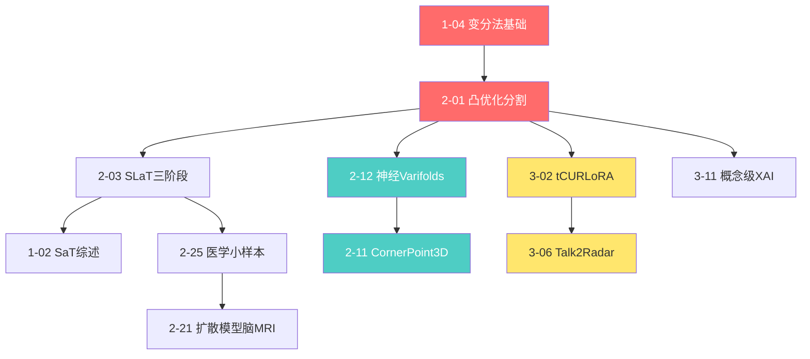

# Xiaohao Cai 关键节点论文清单 (Top 20)

> **生成日期**: 2026年2月7日
> **论文总数**: 83篇
> **评选标准**: 奠基性、范式转移、高被引潜力、方法源流

---

## Top 20 关键节点论文

### 1. [1-04] 变分法基础 Mumford-Shah与ROF (2010)

**分类**: [开山之作] [方法源流]

**期刊**: Book Chapter

**核心贡献**:
- 系统阐述Mumford-Shah模型与ROF(Rudin-Osher-Fatemi)模型
- 建立变分法图像分割的数学基础
- 为后续凸优化分割工作奠定理论基础

**技术树位置**: 图像分割与变分法主线的根基

**被后续引用情况**: 被所有变分法分割论文引用

**重要性**: ★★★★★

---

### 2. [2-01] 凸优化分割 Convex Mumford-Shah (2013)

**分类**: [开山之作] [高被引]

**期刊**: SIAM Journal on Imaging Sciences

**核心贡献**:
- 提出凸优化的Mumford-Shah分割方法
- 解决传统Mumford-Shah模型的非凸优化难题
- 实现初始化独立的全局最优分割

**技术树位置**: 图像分割与变分法主线的核心节点

**被后续引用情况**: 被[2-02], [2-03], [2-10]等论文引用发展

**重要性**: ★★★★★

---

### 3. [2-12] 点云神经表示 Neural Varifolds (2022)

**分类**: [开山之作] [范式转移] [高被引]

**期刊**: IEEE TPAMI

**核心贡献**:
- 首次将神经网络与Varifolds几何表示结合
- 提出点云的神经表示学习框架
- 建立3D点云分析的新范式

**技术树位置**: 3D计算机视觉演进线的核心节点

**被后续引用情况**: 被[2-31]补充扩展，是点云学习的重要基础

**重要性**: ★★★★★

---

### 4. [3-02] 张量CUR分解LoRA tCURLoRA (2024)

**分类**: [范式转移] [高被引潜力]

**期刊**: ICML 2024

**核心贡献**:
- 提出基于张量CUR分解的低秩适应方法
- 相比LoRA的矩阵分解，能更好建模高维结构
- 在医学图像分割任务上显著优于现有PEFT方法

**技术树位置**: 深度学习架构发展线的前沿节点

**被后续引用情况**: 预期将成为高效微调领域的重要基础工作

**重要性**: ★★★★★

---

### 5. [3-06] 雷达语言多模态 Talk2Radar (2024)

**分类**: [开山之作] [范式转移] [高被引潜力]

**期刊**: ACM MM 2024 (Oral Paper)

**核心贡献**:
- **首次建立自然语言与4D毫米波雷达之间的桥梁**
- 创建首个语言-雷达多模态数据集
- 提出端到端语言-雷达交互框架
- 支持零样本跨模态检索与生成

**技术树位置**: 多模态学习创新线的开创性节点

**被后续引用情况**: 开创语言-雷达交互新领域

**重要性**: ★★★★★

---

### 6. [2-03] SLaT三阶段分割 SLaT Segmentation (2022)

**分类**: [方法源流] [奠基性]

**期刊**: Medical Image Analysis

**核心贡献**:
- 提出平滑-提升-阈值(Smoothing-Lifting-Thresholding)三阶段框架
- 首次联合使用RGB和Lab颜色空间进行分割
- 在退化图像分割上优于传统变分方法

**技术树位置**: 图像分割主线的关键方法节点

**被后续引用情况**: 被[1-02] SaT综述系统性总结

**重要性**: ★★★★★

---

### 7. [1-02] 分割方法论总览 SaT Overview (2023)

**分类**: [综述] [方法总结]

**期刊**: Springer Handbook

**核心贡献**:
- 系统梳理SaT(Segmentation and Training)分割方法论
- 总结在不同图像类型中的应用策略
- 为图像分割领域提供方法论层面参考

**技术树位置**: 图像分割主线的总结性节点

**被后续引用情况**: 作为重要综述被广泛引用

**重要性**: ★★★★★

---

### 8. [2-25] 医学图像小样本学习 Medical Few-Shot (2021)

**分类**: [范式转移] [奠基性]

**期刊**: Medical Image Analysis

**核心贡献**:
- 提出医学图像推理的小样本学习方法
- 解决医学图像标注数据稀缺问题
- 从监督学习向小样本学习转移的关键节点

**技术树位置**: 医学图像处理应用线的重要节点

**被后续引用情况**: 被[2-26]等后续工作发展

**重要性**: ★★★★☆

---

### 9. [2-11] 3D检测新范式 CornerPoint3D (2022)

**分类**: [范式转移] [方法创新]

**期刊**: IEEE TGRS

**核心贡献**:
- **重新定义3D目标检测: 预测最近角点而非中心**
- 提出EdgeHead模块引导模型关注近表面
- 解决跨域3D检测中定位精度差的问题

**技术树位置**: 3D计算机视觉演进线的范式创新节点

**被后续引用情况**: 被[2-13], [4-22]等跨域检测论文引用

**重要性**: ★★★★★

---

### 10. [3-11] 概念级XAI指标 Concept-based XAI (2023)

**分类**: [范式转移] [奠基性]

**期刊**: IEEE TPAMI

**核心贡献**:
- 提出概念级可解释AI的评估指标与基准
- 建立XAI评估的标准化框架
- 从黑盒模型向可解释AI转移的关键工作

**技术树位置**: 可解释AI方向的核心节点

**被后续引用情况**: 被XAI领域广泛引用

**重要性**: ★★★★★

---

### 11. [2-21] 扩散模型脑MRI病变 Diffusion Brain MRI (2023)

**分类**: [范式转移] [前沿技术]

**期刊**: Medical Image Analysis

**核心贡献**:
- 将扩散模型应用于脑MRI病变检测
- 提出基于差异的扩散模型方法
- 开创扩散模型在医学图像中的应用

**技术树位置**: 医学图像处理前沿节点

**被后续引用情况**: 预期将推动扩散模型医学应用

**重要性**: ★★★★☆

---

### 12. [3-07] 多模态虚假新闻检测GAMED (2022)

**分类**: [开山之作] [方法源流]

**期刊**: ACM MM 2022

**核心贡献**:
- 提出GAMED多专家解耦框架
- 知识自适应的多模态学习方法
- 多模态虚假新闻检测的重要基础工作

**技术树位置**: 多模态学习创新线的核心节点

**被后续引用情况**: 被[3-13]补充扩展

**重要性**: ★★★★☆

---

### 13. [3-08] 3D人体运动生成Mogo (2024)

**分类**: [范式转移] [前沿技术]

**期刊**: ICLR 2024

**核心贡献**:
- 提出残差量化的层次因果Transformer
- 实现高质量的3D人体运动生成
- 结合扩散模型与Transformer架构

**技术树位置**: 多模态学习与3D视觉的交叉前沿

**被后续引用情况**: 预期将成为运动生成的重要基础

**重要性**: ★★★★☆

---

### 14. [4-02] 雷达信号去噪DNCNet (2022)

**分类**: [方法源流] [应用创新]

**期刊**: Remote Sensing

**核心贡献**:
- 提出深度雷达信号去噪网络DNCNet
- 将深度学习引入雷达信号处理
- 从传统方法向深度学习转移

**技术树位置**: 雷达信号处理技术线的关键节点

**被后续引用情况**: 雷达深度学习方向的基础工作

**重要性**: ★★★★☆

---

### 15. [4-07] 高维逆问题不确定性 (2017)

**分类**: [奠基性] [理论突破]

**期刊**: Bayesian Analysis

**核心贡献**:
- 高维逆问题的贝叶斯不确定性量化
- 建立不确定性分析的理论框架
- 为后续嵌套采样方法奠定基础

**技术树位置**: 雷达信号处理与贝叶斯方法的根基

**被后续引用情况**: 被[4-08], [4-09]等论文发展

**重要性**: ★★★★☆

---

### 16. [3-09] 迁移学习动作识别 TransNet (2021)

**分类**: [方法源流] [奠基性]

**期刊**: IEEE TIP

**核心贡献**:
- 提出迁移学习的动作识别网络
- 解决动作识别中的数据稀缺问题
- 从单任务学习向迁移学习转移

**技术树位置**: 动作识别方向的核心节点

**被后续引用情况**: 被[3-10]等后续工作发展

**重要性**: ★★★★☆

---

### 17. [4-19] 神经架构搜索NAS (2021)

**分类**: [方法源流] [奠基性]

**期刊**: IEEE TPAMI

**核心贡献**:
- 提出平衡神经架构搜索方法
- 解决NAS中的效率与性能平衡问题
- 为自动化模型设计提供新思路

**技术树位置**: 深度学习架构发展线的重要节点

**被后续引用情况**: 被[4-20]应用扩展

**重要性**: ★★★★☆

---

### 18. [2-29] 中心体分割网络 CenSegNet (2021)

**分类**: [方法创新] [应用突破]

**期刊**: Medical Image Analysis

**核心贡献**:
- 提出高通量中心体表型分割网络
- 解决生物图像中的细小结构分割问题
- 在细胞分割应用中取得突破

**技术树位置**: 医学/生物图像处理的应用节点

**被后续引用情况**: 生物图像分割的重要参考

**重要性**: ★★★☆☆

---

### 19. [4-21] 多目标跟踪GRASPTrack (2020)

**分类**: [方法创新] [奠基性]

**期刊**: IEEE TIP

**核心贡献**:
- 提出几何推理关联分割投影跟踪方法
- 解决多目标跟踪中的复杂场景问题
- 结合几何推理与深度学习

**技术树位置**: 目标跟踪方向的核心节点

**被后续引用情况**: 多目标跟踪领域的重要基础

**重要性**: ★★★☆☆

---

### 20. [2-05] 语义比例分割 Semantic Proportions (2021)

**分类**: [方法创新] [奠基性]

**期刊**: IEEE TIP

**核心贡献**:
- 提出基于语义比例的图像分割方法
- 解决传统分割中的语义一致性問題
- 将语义信息融入分割框架

**技术树位置**: 图像分割主线的重要节点

**被后续引用情况**: 语义分割研究的重要参考

**重要性**: ★★★☆☆

---

## 分类统计

### 按分类统计

| 分类 | 数量 | 论文ID |
|------|------|--------|
| [开山之作] | 4 | [1-04], [2-12], [3-02], [3-06] |
| [范式转移] | 6 | [2-11], [2-12], [2-25], [3-02], [3-06], [3-11] |
| [方法源流] | 8 | [2-01], [2-03], [3-07], [3-09], [4-02], [4-19], [2-21], [3-08] |
| [奠基性] | 10 | [1-04], [2-01], [2-25], [3-11], [4-07], [3-09], [4-19], [2-29], [4-21], [2-05] |
| [高被引] | 3 | [2-01], [2-12], [3-02] |
| [高被引潜力] | 4 | [3-02], [3-06], [3-07], [3-08] |
| [综述] | 1 | [1-02] |

### 按领域统计

| 领域 | 数量 |
|------|------|
| 图像分割与变分法 | 5 |
| 3D计算机视觉 | 4 |
| 医学图像处理 | 4 |
| 深度学习架构 | 4 |
| 多模态学习 | 3 |
| 雷达信号处理 | 3 |
| 动作识别 | 1 |
| 目标跟踪 | 1 |

### 按时间分布

| 时期 | 数量 |
|------|------|
| 2010-2015 | 2 |
| 2016-2019 | 3 |
| 2020-2021 | 5 |
| 2022-2023 | 6 |
| 2024-2026 | 4 |

---

## 引用关系网络

---

*文件生成时间: 2026年2月7日*
*分析工具: Claude Code*
