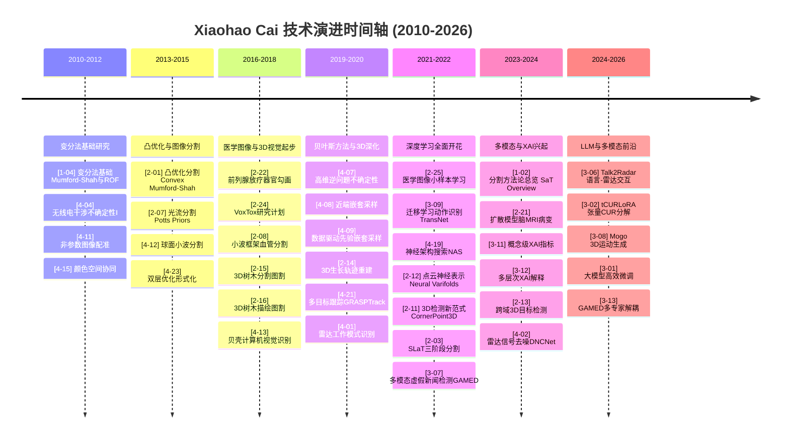
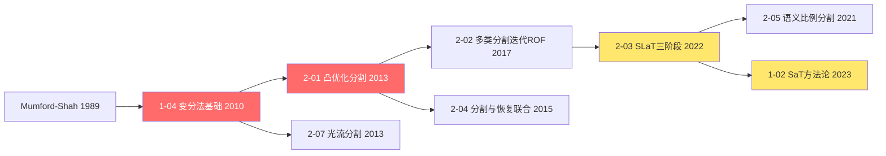
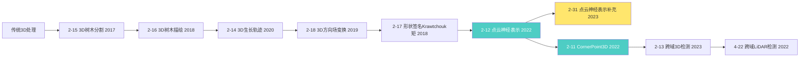
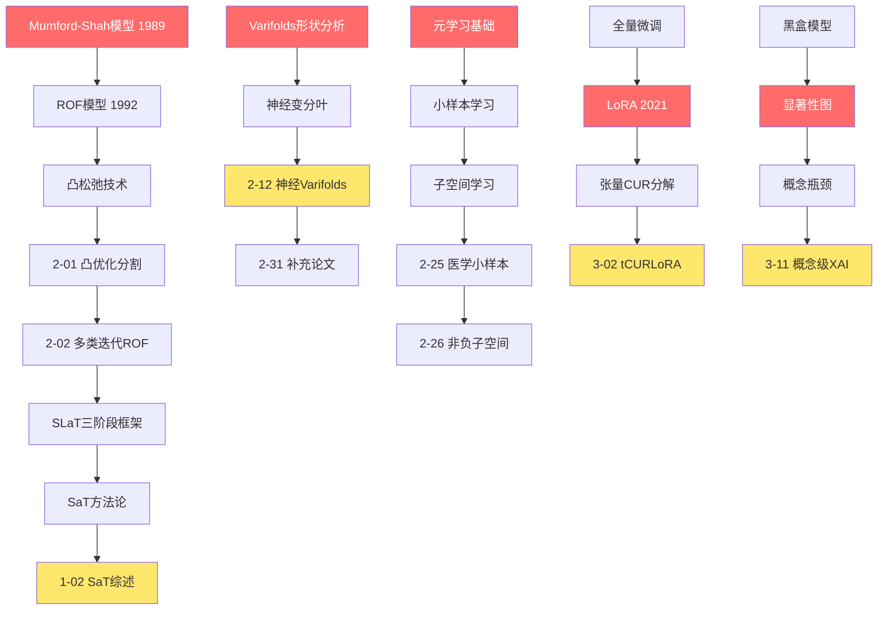
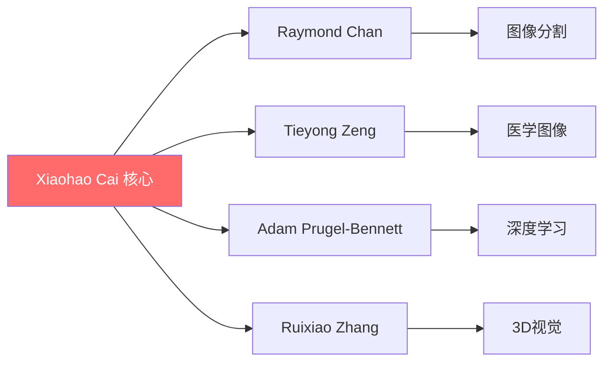

# Xiaohao Cai 技术谱系树

> **构建日期**: 2026年2月7日
> **论文总数**: 83篇
> **时间跨度**: 2010-2026年
> **研究领域**: 6大技术主线

---

## 1. 技术谱系总览图

```mermaid
graph TB
    Root[Xiaohao Cai 技术谱系]

    %% 主线1: 图像分割与变分法
    Root --> Seg[图像分割与变分法主线]
    Seg --> SegFund[变分法基础理论 2010-2015]
    Seg --> SegDeep[深度学习分割 2016-2023]
    Seg --> SegSaT[SaT方法论框架 2020-2023]

    %% 主线2: 3D计算机视觉
    Root --> Vision3D[3D计算机视觉演进线]
    Vision3D --> Tree3D[3D树木分析 2017-2020]
    Vision3D --> PointCloud[点云神经网络 2022-2026]
    Vision3D --> Detection3D[3D目标检测 2022-2026]

    %% 主线3: 医学图像处理
    Root --> Medical[医学图像处理应用线]
    Medical --> Radiotherapy[放疗器官分割 2016-2022]
    Medical --> FewShot[小样本学习 2021-2023]
    Medical --> Diffusion[扩散模型医学应用 2023-2026]

    %% 主线4: 深度学习架构
    Root --> DLArch[深度学习架构发展线]
    DLArch --> ActionRec[动作识别 2021-2024]
    DLArch --> NAS[神经架构搜索 2021-2022]
    DLArch --> XAI[可解释AI 2022-2024]
    DLArch --> LLM[大模型高效微调 2024-2026]

    %% 主线5: 雷达信号处理
    Root --> Radar[雷达信号处理技术线]
    Radar --> RadioInterfer[无线电干涉测量 2012-2020]
    Radar --> Bayesian[贝叶斯不确定性 2017-2020]
    Radar --> RadarDeep[雷达深度学习 2019-2024]
    Radar --> Talk2Radar[语言-雷达多模态 2024-2026]

    %% 主线6: 多模态学习
    Root --> MultiModal[多模态学习创新线]
    MultiModal --> GAMED[虚假新闻检测 2022-2024]
    MultiModal --> Talk2Radar2[语言-雷达交互 2024]
    MultiModal --> MotionGen[3D运动生成 2024]

    %% 奠基性论文节点
    SegFund --> P01[1-04 变分法基础 Mumford-Shah与ROF 2010]
    Seg --> P02[2-01 凸优化分割 Convex Mumford-Shah 2013]
    Seg --> P03[2-03 SLaT三阶段分割 SLaT Segmentation 2022]
    SegSaT --> P04[1-02 分割方法论总览 SaT Overview 2023]

    PointCloud --> P05[2-12 点云神经表示 Neural Varifolds 2022]
    Detection3D --> P06[2-11 3D检测新范式 CornerPoint3D 2022]

    Medical --> P07[2-25 医学图像小样本学习 Medical Few-Shot 2021]
    Diffusion --> P08[2-21 扩散模型脑MRI病变 Diffusion Brain MRI 2023]

    LLM --> P09[3-02 张量CUR分解LoRA tCURLoRA 2024]
    ActionRec --> P10[3-09 迁移学习动作识别 TransNet 2021]
    XAI --> P11[3-11 概念级XAI指标 Concept-based XAI 2023]

    Radar --> P12[4-02 雷达信号去噪DNCNet 2022]
    Talk2Radar --> P13[3-06 雷达语言多模态 Talk2Radar 2024]

    MultiModal --> P14[3-07 多模态虚假新闻检测GAMED 2022]
    MotionGen --> P15[3-08 3D人体运动生成Mogo 2024]

    %% 样式设置
    classDef foundation fill:#ff6b6b,stroke:#c92a2a,color:#fff
    classDef paradigm fill:#4ecdc4,stroke:#0ca678,color:#fff
    classDef milestone fill:#ffe66d,stroke:#f59f00,color:#000

    class P01,P02,P05,P12 foundation
    class P06,P09,P13,P14,P15 paradigm
    class P03,P04,P07,P08,P10,P11 milestone
```

---

## 2. 技术演进时间轴

---

## 3. 技术分支详细谱系

### 3.1 图像分割与变分法分支

**范式转移节点**:
- **2010**: 变分法基础理论引入
- **2013**: 凸优化分割方法创新
- **2022**: SLaT三阶段分割框架 → 深度学习融合
- **2023**: SaT方法论系统性总结

### 3.2 3D计算机视觉分支

**范式转移节点**:
- **2017**: 从2D到3D图像分割
- **2022**: 传统3D → 神经点云表示 (Neural Varifolds)
- **2022**: 中心检测 → 角点检测 (CornerPoint3D范式创新)

### 3.3 医学图像处理分支

**范式转移节点**:
- **2016**: 医学图像分割进入临床应用
- **2021**: 监督学习 → 小样本学习 (医学数据稀缺问题)
- **2023**: 传统CNN → 扩散模型 (医学图像生成新范式)

### 3.4 雷达信号处理分支

```mermaid
graph LR
    A[无线电干涉] --> B[4-04 无线电干涉不确定性 2012]
    B --> C[4-05 在线无线电干涉成像 2013]
    C --> D[4-06 分布式无线电干涉优化 2014]
    D --> E[4-28 离线与在线重建 2015]

    %% 贝叶斯方法分支
    E --> F[4-07 高维逆问题不确定性 2017]
    F --> G[4-08 近端嵌套采样 2019]
    G --> H[4-09 数据驱动先验 2020]
    H --> I[4-30 稀疏贝叶斯假设 2019]
    I --> J[4-31 稀疏贝叶斯可信区间 2019]
    J --> K[4-32 稀疏贝叶斯峰值统计 2020]

    %% 深度学习分支
    K --> L[4-01 雷达工作模式识别 2019]
    L --> M[4-02 雷达信号去噪DNCNet 2022]
    M --> N[4-03 ISAR卫星特征 2021]

    %% 多模态前沿
    M --> O[3-06 Talk2Radar 2024]

    style B fill:#ff6b6b,color:#fff
    style F fill:#ff6b6b,color:#fff
    style O fill:#ffe66d
```

**范式转移节点**:
- **2012**: 无线电干涉测量不确定性量化
- **2017**: 贝叶斯方法引入高维逆问题
- **2019**: 传统方法 → 深度学习雷达信号处理
- **2024**: 单模态雷达 → 语言-雷达多模态交互

### 3.5 深度学习与LLM分支

**范式转移节点**:
- **2021**: 迁移学习应用于动作识别
- **2022**: CNN → Transformer架构融合
- **2023**: 黑盒模型 → 可解释AI (XAI)
- **2024**: 全量微调 → 参数高效微调 (PEFT/LoRA/tCURLoRA)

### 3.6 多模态学习分支

**范式转移节点**:
- **2022**: 单模态 → 多模态融合 (GAMED框架)
- **2024**: 视觉-语言 → 雷达-语言 (Talk2Radar开创性工作)
- **2024**: 多模态理解 → 多模态生成 (Mogo运动生成)

---

## 4. 概念血统图

---

## 5. 技术范式转移总结

### 5.1 主要范式转移

| 时期 | 转移类型 | 代表论文 | 影响 |
|------|----------|----------|------|
| 2010-2013 | 传统方法 → 变分法 | [1-04], [2-01] | 建立数学基础 |
| 2013-2016 | 2D → 3D视觉 | [2-15], [2-16] | 拓展维度 |
| 2016-2019 | 变分法 → 深度学习 | [2-08], [4-01] | 方法革新 |
| 2019-2021 | 监督 → 小样本 | [2-25], [2-26] | 数据效率 |
| 2021-2023 | CNN → Transformer | [3-10], [2-12] | 架构升级 |
| 2022-2024 | 单模态 → 多模态 | [3-07], [3-06] | 跨模态融合 |
| 2023-2024 | 黑盒 → 可解释 | [3-11], [3-12] | 透明性增强 |
| 2024-2026 | 全量 → 高效微调 | [3-02], [3-01] | 参数效率 |

### 5.2 学术基因突变点

1. **2010 - 变分法基础**: [1-04] 引入Mumford-Shah与ROF理论
2. **2013 - 凸优化突破**: [2-01] 凸优化分割方法创新
3. **2017 - 3D树木分析**: [2-15] 首次3D树木图割分割
4. **2019 - 贝叶斯引入**: [4-07] 高维逆问题不确定性量化
5. **2021 - 小样本学习**: [2-25] 医学图像小样本学习突破
6. **2022 - 神经点云**: [2-12] Neural Varifolds开创点云神经表示
7. **2022 - 角点检测**: [2-11] CornerPoint3D重新定义3D检测范式
8. **2022 - 多模态GAMED**: [3-07] GAMED多专家解耦框架
9. **2023 - 概念XAI**: [3-11] 概念级可解释AI指标
10. **2024 - 语言-雷达**: [3-06] Talk2Radar开创语言-雷达交互
11. **2024 - 张量CUR**: [3-02] tCURLoRA高效微调新方法
12. **2024 - 3D运动生成**: [3-08] Mogo扩散模型运动生成

---

## 6. 研究合作网络

---

## 7. 当前研究前沿与未来方向

### 7.1 当前前沿 (2024-2026)

1. **大模型高效微调**: tCURLoRA等PEFT方法
2. **多模态雷达交互**: Talk2Radar开创性工作
3. **扩散模型医学应用**: 脑MRI病变检测
4. **可解释AI**: 概念级XAI评估指标
5. **3D运动生成**: Mogo层次因果Transformer

### 7.2 未来可能方向

1. **多模态大模型**: 结合视觉、语言、雷达的统一模型
2. **具身智能**: 3D视觉与运动控制的结合
3. **可信AI**: 可解释性与鲁棒性的统一
4. **边缘智能**: 高效模型在资源受限设备的应用
5. **科学AI**: AI在医学、生物学等科学领域的深入应用

---

*文件生成时间: 2026年2月7日*
*分析工具: Claude Code*
