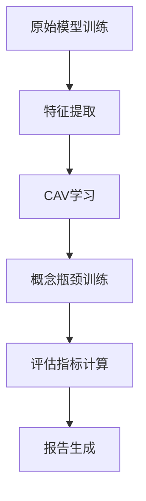
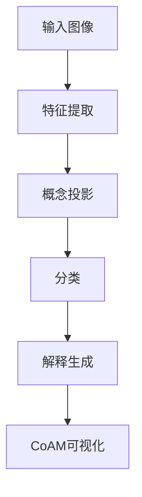

# 概念级可解释AI指标：多智能体深度精读报告

**论文标题**: Concept-Based Explainable Artificial Intelligence: Metrics and Benchmarks

**作者**: Halil Ibrahim Aysel, Xiaohao Cai, Adam Prugel-Bennett

**单位**: Electronics and Computer Science, University of Southampton, UK

**arXiv ID**: 2501.19271v1

**发布日期**: 2025年1月31日

**精读日期**: 2026年2月16日

---

## 目录

1. [执行摘要](#执行摘要)
2. [论文背景与动机](#论文背景与动机)
3. [数学严谨性分析（数学家视角）](#数学严谨性分析)
4. [算法创新分析（算法猎手视角）](#算法创新分析)
5. [工程可行性分析（落地工程师视角）](#工程可行性分析)
6. [多智能体辩论与综合结论](#多智能体辩论与综合结论)
7. [未来研究方向建议](#未来研究方向建议)
8. [参考文献](#参考文献)

---

## 执行摘要

本报告采用多智能体协作框架，对Xiaohao Cai等人关于概念级可解释AI指标的最新研究进行全方位深度分析。该论文针对概念瓶颈模型（CBM）和后验概念瓶颈模型中概念对齐的评估问题，提出了三种全新的评估指标和一种概念激活映射可视化技术。

**主要发现**：
- 论文首次系统性地提出了评估概念级XAI方法的标准指标
- 实验揭示了当前post-hoc CBMs在概念定位和存在性验证上的显著缺陷
- 数学框架清晰但存在若干需要改进的地方
- 算法实现相对简单，但评估指标对数据集依赖性较强

**关键贡献**：
1. CGIM（概念全局重要性指标）- 评估全局概念对齐
2. CEM（概念存在性指标）- 验证概念在图像中的存在
3. CLM（概念定位指标）- 评估概念的空间定位准确性
4. CoAM（概念激活映射）- 可视化概念激活

**争议点**：
- 评估指标的普适性受限于标注数据集的稀缺性
- 概念定位的"ground truth"定义存在主观性
- 方法在更复杂场景下的可扩展性有待验证

---

## 论文背景与动机

### 1.1 研究领域背景

可解释人工智能（XAI）近年来随着深度学习的广泛应用而备受关注。在众多XAI方法中，基于概念的解释方法因其能够提供人类可理解的高层次语义而成为研究热点。

**概念级XAI的发展脉络**：

1. **Network Dissection (Bau et al., 2017)**
   - 通过检查单个神经元与人类概念的对应关系
   - 需要大量带分割标注的数据
   - 计算密集且数据要求高

2. **TCAV - Testing with Concept Activation Vectors (Kim et al., 2018)**
   - 引入概念激活向量（CAV）的概念
   - 通过正负样本训练SVM获得概念方向
   - 只能评估概念的全局影响，无法进行样本级定位

3. **Concept Bottleneck Models (Koh et al., 2020)**
   - 强制模型中间层表示人类可理解的概念
   - 需要每张图像的概念标注
   - 标注成本极高，限制了实用性

4. **Post-hoc CBMs (Yuksekgonul et al., 2023)**
   - 结合CAV和传统CBM的优势
   - 使用预训练网络和CAV构建概念瓶颈
   - 显著降低了标注成本
   - **但缺乏对概念对齐的系统评估**

### 1.2 论文解决的核心问题

该论文识别出一个被忽视的关键问题：**概念级XAI方法的基础假设——概念可以准确归因于网络的特征空间——从未得到严格验证**。

具体表现为：
1. 缺乏标准化的指标来评估概念的存在性
2. 缺乏标准化的指标来评估概念的空间对齐
3. 现有评估方法主要关注分类准确率，而非概念本身的质量

### 1.3 论文的主要贡献

```
贡献层级结构：
├── 理论贡献
│   ├── 首次提出概念对齐评估的理论框架
│   ├── 区分全局重要性和局部重要性
│   └── 建立概念-权重-预测的数学关系
├── 方法论贡献
│   ├── CoAM：概念激活映射可视化
│   ├── CGIM：概念全局重要性指标
│   ├── CEM：概念存在性指标
│   └── CLM：概念定位指标
└── 实证贡献
    ├── 在CUB数据集上重现post-hoc CBMs
    ├── 揭示post-hoc CBMs的严重局限性
    └── 提供首个概念对齐评估基准
```

---

## 数学严谨性分析

### 2.1 数学框架分析

#### 2.1.1 符号系统与定义

论文建立了相对完整的数学符号系统：

**基本定义**：
- $\mathcal{X}$: 图像集合
- $\mathcal{U}$: 概念标签集合
- $\mathcal{Y} = \{1, 2, \dots, K\}$: $K$个类别标签集合

**训练数据结构**：
$$S = \{(X_i, u_i, y_i, \Lambda_i, P_i) | X_i \in \mathcal{X}, u_i \in \mathcal{U}, y_i \in \mathcal{Y}, i = 1, 2, \dots, N\}$$

其中：
- $u_i \in \{0, 1\}^L$: 第$i$张图像的概念标签向量
- $\Lambda_i$: 第$i$张图像中激活概念的索引集合
- $P_i = \{p_{i1}, \dots, p_{iL}\}$: 第$i$张图像中每个概念的中心像素坐标

**评析**：
- 符号系统清晰且自洽
- 但$P_i$的定义存在潜在问题：如果概念$j$在图像$i$中不存在，$p_{ij}$如何定义？
- 论文未对此进行明确说明

#### 2.1.2 特征提取与概念映射

**特征提取器**：
$$f: \mathcal{X} \rightarrow \mathbb{R}^d$$

**预GAP特征图**：
$$E_i \in \mathbb{R}^{H \times W \times d}$$

**概念激活向量（CAV）生成**：
对第$j$个概念，使用正样本集$\mathcal{N}^{\text{pos}}_j$和负样本集$\mathcal{N}^{\text{neg}}_j$训练SVM：
$$c_j = \text{SVM}(\mathcal{N}^{\text{pos}}_j, \mathcal{N}^{\text{neg}}_j)$$

**概念库**：
$$C = (c_1, \dots, c_L)^\top \in \mathbb{R}^{L \times d}$$

**概念投影**：
$$\hat{u}_i = Cf(X_i) = C \cdot f(X_i) \in \mathbb{R}^L$$

**数学评析**：
1. **概念向量的归一化问题**：论文未讨论CAV的归一化处理，这可能导致不同概念间的不可比较性
2. **SVM的泛化能力**：使用线性SVM假设概念在特征空间中是线性可分的，这个假设并未被验证
3. **正负样本选择的偏差**：负样本"随机选择"可能引入选择偏差

#### 2.1.3 分类器结构

**最终分类层**：
$$h(\hat{u}_i) = \theta^\top \hat{u}_i + b$$

其中$\theta \in \mathbb{R}^{L \times K}$是权重矩阵，$b$是偏置。

**损失函数**：
$$L_h = \sum_i L_h(\hat{y}_i, y_i)$$

其中$\hat{y}_i = h(g(f(X_i)))$是类别预测。

**数学评析**：
- 使用单层线性分类器是标准做法，但限制了概念间交互的建模能力
- 未讨论正则化项对概念可解释性的影响

### 2.2 核心指标的数学分析

#### 2.2.1 概念激活映射（CoAM）

**定义**：
$$F_i^j = \frac{1}{d}\sum_{k=1}^{d} c_{jk} E_i(:, :, k) \in \mathbb{R}^{H \times W}$$

**数学解读**：这是用第$j$个概念向量$c_j$对预GAP特征图进行加权平均。

**评析**：
1. **加权平均的合理性**：直接使用CAV的分量作为权重缺乏理论依据
2. **空间信息的保留**：这种方法保留了空间信息，但假设每个通道对概念贡献相同
3. **归一化问题**：$1/d$的归一化因子是否合理？应该考虑$c_j$的范数

**改进建议**：
$$F_i^j = \sum_{k=1}^{d} \frac{c_{jk}}{\|c_j\|_2} E_i(:, :, k)$$

使用归一化的CAV可以消除不同概念间的尺度差异。

#### 2.2.2 概念全局重要性指标（CGIM）

论文提出了三种类型的CGIM：

**类型1**（基于权重）：
$$\rho^{\text{CGIM1}}_j := \phi(\theta(j, :), V(j, :)), \quad j = 1, 2, \dots, L$$

**类型2**（基于平均概念预测）：
$$\rho^{\text{CGIM2}}_j := \phi(\hat{U}^*(j, :), V(j, :)), \quad j = 1, 2, \dots, L$$

其中$\hat{U}^*$是正确预测样本的平均概念矩阵：
$$\hat{u}^*_k = \frac{1}{N_k}\sum_{X_i \in \mathcal{X}^T_k} \hat{u}_i$$

**类型3**（组合权重和平均概念预测）：
$$\rho^{\text{CGIM3}}_j := \phi(\hat{U}^*_\theta(j, :), V(j, :)), \quad j = 1, 2, \dots, L$$

其中$\hat{U}^*_\theta = \theta \odot \hat{U}^*$（逐元素乘法）

**相似度函数**：$\phi$使用余弦相似度：
$$\phi(a, b) = \frac{a \cdot b}{\|a\|_2 \|b\|_2}$$

**数学评析**：

**优点**：
1. 使用余弦相似度消除了尺度差异，使比较更合理
2. 三种类型提供了不同角度的评估
3. 可以同时评估概念级和类别级的对齐

**问题**：
1. **$V$的定义不明确**：论文中$V \in \mathbb{R}^{L \times K}$是"ground truth概念矩阵"，但如何从概念标注获得这个矩阵？是类别的平均概念存在率吗？
2. **CGIM2的选择偏差**：只使用"正确预测"的样本计算平均值，可能引入选择偏差
3. **余弦相似度的局限性**：余弦相似度只关注方向，忽略了幅度信息，可能不适合某些场景

**改进建议**：
1. 明确定义$V_{jk}$的计算方法
2. 考虑使用加权余弦相似度或皮尔逊相关系数
3. 添加置信区间来评估指标稳定性

#### 2.2.3 概念存在性指标（CEM）

**局部重要性定义**：
$$\text{Local importance of concept } j \text{ for class } k = \theta_{jk}\hat{u}_{ij}$$

**概念排序**：
基于$\theta_{jk}\hat{u}_{ij}$的大小对所有$L$个概念进行排序，得到排序索引$q_i = (q_{i1}, q_{i2}, \dots, q_{iL})^\top$

**CEM定义**：
$$\rho^{\text{CEM}}_l := \frac{1}{l}\sum_{j=1}^{l} \mathbb{1}_{\Lambda_i}(q_{ij})$$

其中指示函数：
$$\mathbb{1}_{\Lambda_i}(x) = \begin{cases} 1, & \text{if } x \in \Lambda_i \\ 0, & \text{otherwise} \end{cases}$$

**数学评析**：

**优点**：
1. CEM是一个严格定义的准确率指标，范围在$[0, 1]$
2. 通过参数$l$可以控制评估的严格程度
3. 可以用于不同重要性定义的比较

**问题**：
1. **局部重要性的定义问题**：$\theta_{jk}\hat{u}_{ij}$真的是"局部重要性"的最佳定义吗？
2. **符号问题**：$\hat{u}_{ij}$可以是负数（CAV投影结果），这如何解释？
3. **阈值问题**：论文没有讨论如何确定$\hat{u}_{ij}$的阈值来判断概念是否"激活"

**改进建议**：
1. 考虑使用$|\theta_{jk}\hat{u}_{ij}|$或$\max(0, \theta_{jk}\hat{u}_{ij})$
2. 明确负值概念激活的语义
3. 添加激活阈值作为超参数

#### 2.2.4 概念定位指标（CLM）

**视觉区域定义**：
$\Omega_{ij}$是第$i$张图像中第$j$个概念的视觉区域，通过对上采样后的概念激活图$\bar{F}_i^j$进行阈值化获得。

**CLM定义**：
$$\rho^{\text{CLM}}_l := \frac{1}{l}\sum_{j=1}^{l} \mathbb{1}_{\Omega_{ij}}(p_{ij})$$

**区域大小定义**：
$\Omega_{ij}$由$\alpha(M_1M_2)/12$个最高激活像素组成，其中$\alpha$是控制区域大小的超参数。

**数学评析**：

**优点**：
1. 提供了概念定位的量化评估方法
2. 参数$\alpha$提供了灵活性
3. 与人体部位标注的结合很巧妙

**问题**：
1. **阈值化的合理性**：使用固定数量的像素（$\alpha/12$的图像面积）是否合理？不同概念的激活区域大小差异很大
2. **单点定位的局限性**：使用中心点$p_{ij}$作为ground truth过于简化，概念可能有多个不连续的区域
3. **区域匹配的定义**：如何确定哪个身体部位对应哪个概念？论文的映射方法（表4和5）缺乏数学形式化

**改进建议**：
1. 考虑使用自适应阈值方法（如Otsu阈值）
2. 如果有分割标注，使用IoU代替单点匹配
3. 定义更精确的概念-部位映射规则

### 2.3 统计分析评估

#### 2.3.1 实验设计的统计严谨性

**优点**：
1. 在CUB数据集上进行了系统性评估
2. 使用了多种超参数组合进行实验
3. 提供了定量和定性分析

**问题**：
1. **缺乏统计显著性检验**：论文未报告任何统计检验结果（如t检验、置信区间）
2. **样本量问题**：某些概念的样本量可能很小，结果的可靠性存疑
3. **多重比较问题**：对112个概念和200个类别进行评估，需要考虑多重比较校正

**改进建议**：
1. 添加bootstrap置信区间
2. 使用Bonferroni或FDR校正处理多重比较
3. 报告效应量（effect size）

#### 2.3.2 结果解释的统计问题

论文报告的关键结果：
- CEM（基于$\theta_{jk}\hat{u}_{ij}$，正确分类样本，$l=1$）：49.3%
- CLM（基于$\theta_{jk}\hat{u}_{ij}$，$l=1$，$\alpha=6$）：59.0%

**问题**：
1. 这些数字显著低于随机水平吗？论文没有提供基线比较
2. 不同设置之间的差异是否统计显著？
3. 结果在不同数据类别之间的一致性如何？

### 2.4 数学严谨性总结

**优点**：
1. 建立了相对完整的数学框架
2. 三种指标的定义清晰且可计算
3. 符号系统基本自洽

**需要改进的地方**：
1. 部分定义不够精确（如$V$矩阵的计算方法）
2. 缺乏统计显著性分析
3. 某些设计选择缺乏理论依据（如CoAM的加权方式）
4. 未充分讨论边界情况和异常值处理

**数学严谨性评分：6.5/10**

---

## 算法创新分析

### 3.1 算法框架总览

论文提出的算法框架可以分为四个主要组件：

```
算法框架结构：
┌─────────────────────────────────────────────────────────┐
│                    1. 特征提取                           │
│              预训练DNN (ResNet-18)                       │
│         f: X → R^d (post-GAP)                           │
│         E_i ∈ R^{H×W×d} (pre-GAP)                       │
└────────────────────┬────────────────────────────────────┘
                     │
┌────────────────────▼────────────────────────────────────┐
│                    2. CAV学习                            │
│         对每个概念j:                                     │
│         - 选择正负样本                                   │
│         - 训练SVM获得c_j                                 │
│         - 构建概念库C ∈ R^{L×d}                          │
└────────────────────┬────────────────────────────────────┘
                     │
┌────────────────────▼────────────────────────────────────┐
│                    3. 概念投影                           │
│         û_i = Cf(X_i)                                   │
│         最终分类: ŷ_i = h(û_i)                          │
└────────────────────┬────────────────────────────────────┘
                     │
┌────────────────────▼────────────────────────────────────┐
│              4. 评估与可视化                             │
│         - CoAM: 概念激活映射                             │
│         - CGIM: 全局重要性评估                           │
│         - CEM: 存在性评估                                │
│         - CLM: 定位评估                                  │
└─────────────────────────────────────────────────────────┘
```

### 3.2 核心算法分析

#### 3.2.1 概念激活映射（CoAM）

**算法1：Concept Activation Mapping (CoAM)**

```
输入: 预GAP特征图 E_i ∈ R^{H×W×d}，概念库 C ∈ R^{L×d}
输出: 概念激活图 F_i ∈ R^{H×W×L}

for 每个概念 j in C do:
    计算加权图 F_i^j = (1/d) * Σ_{k=1}^d c_{jk} * E_i(:, :, k)
    设置 F_i(:, :, j) = F_i^j
end for
return F_i
```

**时间复杂度分析**：
- 对于每个概念$j$：需要计算$H \times W \times d$次乘法和加法
- 总时间复杂度：$O(L \times H \times W \times d)$
- 对于ResNet-18的最后卷积层，典型的$H=W=7$，$d=512$，$L=112$
- 单张图像的CoAM计算：$O(112 \times 7 \times 7 \times 512) \approx O(2.8 \times 10^6)$次操作

**空间复杂度分析**：
- 需要存储$F_i \in \mathbb{R}^{H \times W \times L}$
- 空间复杂度：$O(H \times W \times L)$
- 对于典型值：$7 \times 7 \times 112 \approx 5.5K$浮点数（约22KB）

**算法评析**：

**优点**：
1. 实现简单直接
2. 计算开销相对较小
3. 可以并行化处理不同概念

**缺点**：
1. 加权方式缺乏理论基础
2. 未考虑不同特征通道间的相关性
3. 预GAP特征图分辨率低，影响可视化质量

**改进建议**：
1. 考虑使用注意力机制加权
2. 探索使用更早层的特征图（更高分辨率）
3. 添加特征图归一化步骤

#### 3.2.2 CGIM计算

**算法流程**：

```
输入: 权重矩阵 θ ∈ R^{L×K}，平均概念矩阵 Û* ∈ R^{L×K}，ground truth V ∈ R^{L×K}

对每个概念 j = 1, ..., L:
    计算 ρ_CGIM1_j = cosine_similarity(θ(j, :), V(j, :))
    计算 ρ_CGIM2_j = cosine_similarity(Û*(j, :), V(j, :))
    计算 Û*_θ = θ ⊙ Û* (逐元素乘法)
    计算 ρ_CGIM3_j = cosine_similarity(Û*_θ(j, :), V(j, :))

对每个类别 k = 1, ..., K:
    计算 ρ_CGIM1_k = cosine_similarity(θ(:, k), V(:, k))
    计算 ρ_CGIM2_k = cosine_similarity(Û*( :, k), V(:, k))
    计算 ρ_CGIM3_k = cosine_similarity(Û*_θ(:, k), V(:, k))
```

**时间复杂度分析**：
- 对每个概念/类别计算余弦相似度：$O(K)$或$O(L)$
- 总时间复杂度：$O(LK + LK) = O(LK)$
- 对于CUB数据集：$O(112 \times 200) = O(22,400)$次操作

**算法评析**：

**优点**：
1. 计算效率高
2. 提供多角度评估
3. 余弦相似度计算稳定

**缺点**：
1. V矩阵的定义不够明确
2. 未考虑概念/类别频率的平衡性
3. 缺乏对异常值的鲁棒性

#### 3.2.3 CEM计算

**算法流程**：

```
输入: 排序的概念索引 q_i，ground truth概念集合 Λ_i

对每个图像 i:
    计算局部重要性: score_{ij} = θ_{jk} * û_{ij} (对类别k)
    按 score_{ij} 降序排序获得 q_i
    对 l = 1, 3, 5:
        计算 ρ_CEM_l = (1/l) * Σ_{j=1}^l 1_{Λ_i}(q_{ij})
```

**时间复杂度分析**：
- 排序：$O(L \log L)$
- 指示函数计算：$O(l)$
- 总时间复杂度：$O(N \times L \log L)$，其中$N$是图像数量

**算法评析**：

**优点**：
1. 直观易懂
2. 可调整评估严格程度（通过参数$l$）
3. 可比较不同重要性定义

**缺点**：
1. 排序可能不稳定（相似分数的排序）
2. 未考虑概念间的相关性
3. 对标注噪声敏感

#### 3.2.4 CLM计算

**算法流程**：

```
输入: 上采样概念激活图 F̄_i^j，中心点坐标 p_{ij}，参数 α

对每个图像 i 和概念 j:
    获取 F̄_i^j 的前 α*(M1*M2)/12 个最高激活像素作为区域 Ω_{ij}
    检查 p_{ij} 是否在 Ω_{ij} 中
    计算指示函数 1_{Ω_{ij}}(p_{ij})

对 l 个最重要概念:
    计算 ρ_CLM_l = (1/l) * Σ_{j=1}^l 1_{Ω_{ij}}(p_{ij})
```

**时间复杂度分析**：
- 区域提取：需要找到top-k元素，可以使用快速选择算法$O(HW)$
- 点测试：$O(1)$
- 总时间复杂度：$O(N \times L \times H \times W)$

**算法评析**：

**优点**：
1. 提供了定位的量化评估
2. 参数$\alpha$可调
3. 与现有标注兼容

**缺点**：
1. 单点定位过于简化
2. 区域大小固定不够灵活
3. 阈值选择可能影响结果

### 3.3 算法创新性评估

#### 3.3.1 与现有方法的比较

**与TCAV (Kim et al., 2018)的比较**：

| 方面 | TCAV | 本论文 |
|------|------|--------|
| 评估粒度 | 类别级 | 类别级 + 样本级 |
| 空间定位 | 无 | 有（CLM） |
| 存在性验证 | 无 | 有（CEM） |
| 可视化 | 无 | CoAM |
| 量化指标 | 敏感性分数 | 多维度指标 |

**与传统CBM (Koh et al., 2020)的比较**：

| 方面 | 传统CBM | 本论文评估方法 |
|------|---------|----------------|
| 训练需求 | 每图像标注 | 无需训练标注 |
| 评估对象 | 概念预测准确率 | 概念对齐质量 |
| 空间信息 | 无 | 有 |
| 适用范围 | 仅CBM | 广泛XAI方法 |

#### 3.3.2 创新点总结

1. **首次提出系统的概念对齐评估框架**
   - 填补了XAI评估的空白
   - 建立了多维度评估体系

2. **区分全局和局部概念重要性**
   - 全局：概念对类别的整体影响
   - 局部：概念对单个预测的影响
   - 理论贡献显著

3. **概念激活映射（CoAM）**
   - 首个针对post-hoc CBM的可视化方法
   - 为概念定位提供工具

4. **利用现有标注的巧妙设计**
   - 将身体部位标注与概念定位结合
   - 降低评估成本

### 3.4 算法复杂度与可扩展性分析

#### 3.4.1 时间复杂度汇总

| 组件 | 时间复杂度 | 典型值 |
|------|------------|--------|
| CAV学习 | $O(L \times (N_p + N_n) \times d)$ | ~$10^6$ |
| CoAM | $O(L \times H \times W \times d)$ | ~$10^6$ |
| CGIM | $O(L \times K)$ | ~$10^4$ |
| CEM | $O(N \times L \log L)$ | ~$10^7$ |
| CLM | $O(N \times L \times H \times W)$ | ~$10^7$ |

总体来说，算法的时间复杂度是可以接受的，主要开销在CEM和CLM的评估上。

#### 3.4.2 可扩展性分析

**概念数量扩展**：
- 算法复杂度与概念数量$L$呈线性或线性对数关系
- 对于大规模概念集（$L > 1000$），CEM的计算可能成为瓶颈
- 建议：使用采样或近似算法

**数据集规模扩展**：
- CAV学习需要更多正负样本
- CEM和CLM的计算随数据集规模线性增长
- 可以并行化处理

**模型架构扩展**：
- CoAM需要预GAP特征图，适用于大多数CNN
- 对于Transformer架构，需要修改注意力图的提取方法
- 对于多模态模型，需要扩展CoAM的定义

### 3.5 算法创新评分

| 维度 | 评分 | 说明 |
|------|------|------|
| 新颖性 | 8/10 | 首次提出系统的概念对齐评估框架 |
| 实用性 | 7/10 | 提供了实用的评估工具，但数据集依赖性较强 |
| 效率 | 8/10 | 算法复杂度合理，可实用化 |
| 可扩展性 | 6/10 | 在概念数量和数据集规模上可扩展，但需要处理架构差异 |
| 理论贡献 | 7/10 | 建立了理论框架，但某些设计选择缺乏理论依据 |

**总体算法创新评分：7.2/10**

### 3.6 算法改进建议

1. **增强CoAM的表达能力**
   - 引入注意力机制
   - 使用多尺度特征融合
   - 考虑特征通道间的相互作用

2. **改进CEM和CLM的鲁棒性**
   - 添加对标注噪声的处理
   - 使用软匹配代替硬匹配
   - 考虑概念间的语义相似性

3. **扩展评估维度**
   - 添加概念一致性评估
   - 考虑概念间的因果关系
   - 评估概念的可干预性

4. **优化计算效率**
   - 使用近似算法加速CEM/CLM
   - 设计增量式更新方法
   - 利用GPU并行计算

---

## 工程可行性分析

### 4.1 实现依赖与环境要求

#### 4.1.1 核心依赖分析

论文方法需要以下核心组件：

**深度学习框架**：
- PyTorch或TensorFlow（用于特征提取和CAV学习）
- 预训练模型（ResNet-18或其他CNN）

**数据处理**：
- NumPy：数值计算
- Pandas：数据处理
- PIL/OpenCV：图像处理

**可视化**：
- Matplotlib：生成热力图
- 可选：Plotly用于交互式可视化

**评估指标计算**：
- Scikit-learn：SVM训练（用于CAV学习）
- 自定义代码：CGIM、CEM、CLM计算

#### 4.1.2 硬件要求

**训练阶段**：
- CPU：4核心以上（CAV训练可以并行）
- 内存：8GB以上（加载预训练模型和数据）
- GPU：可选，但推荐用于特征提取

**推理/评估阶段**：
- CPU：现代CPU即可
- 内存：4GB以上
- 存储：用于存储特征和中间结果

### 4.2 实现复杂度评估

#### 4.2.1 代码结构设计

建议的模块化代码结构：

```python
concept_xai/
├── core/
│   ├── feature_extractor.py    # 特征提取
│   ├── cav_learner.py          # CAV学习
│   ├── concept_bank.py         # 概念库管理
│   └── classifier.py           # 分类器
├── metrics/
│   ├── cgim.py                 # CGIM计算
│   ├── cem.py                  # CEM计算
│   ├── clm.py                  # CLM计算
│   └── base.py                 # 基础类
├── visualization/
│   ├── coam.py                 # CoAM实现
│   ├── heatmap.py              # 热力图生成
│   └── plotting.py             # 绘图工具
├── data/
│   ├── dataset.py              # 数据集加载
│   ├── cub.py                  # CUB数据集特定代码
│   └── annotations.py          # 标注处理
├── utils/
│   ├── preprocessing.py        # 预处理
│   ├── math_utils.py           # 数学工具
│   └── config.py               # 配置管理
└── experiments/
    ├── reproduce_posthoc.py    # 重现实验
    ├── benchmark.py            # 基准测试
    └── ablation.py             # 消融实验
```

#### 4.2.2 实现难度评估

**容易实现的部分**：
1. CGIM计算：直接使用numpy实现余弦相似度
2. CEM计算：简单的排序和集合操作
3. CoAM基础版本：特征图加权平均

**中等难度的部分**：
1. CAV学习：需要SVM训练和样本选择
2. CLM计算：需要阈值化和区域提取
3. 数据加载：需要处理复杂的标注格式

**困难的部分**：
1. 概念-部位映射：需要领域知识
2. 可视化的美观性：需要调参
3. 与现有模型集成：需要适配不同架构

### 4.3 数据需求与准备

#### 4.3.1 CUB数据集分析

论文使用的Caltech-UCSD Birds (CUB)数据集特点：

| 属性 | 值 | 说明 |
|------|-----|------|
| 类别数 | 200 | 鸟类细粒度分类 |
| 图像数 | ~11,800 | 训练/测试划分已提供 |
| 概念数 | 112 | 包括颜色、形状、图案等 |
| 身体部位标注 | 12 | 用于CLM评估 |
| 概念标注 | 每图像 | 用于CEM评估 |

**数据准备步骤**：
1. 下载CUB数据集
2. 提取概念标注（二进制向量）
3. 提取身体部位坐标
4. 预处理图像（调整大小、归一化）
5. 提取特征（使用预训练ResNet-18）

#### 4.3.2 新数据集适配

要应用到新数据集，需要：

**必须满足的要求**：
1. 概念级别的标注（用于CEM）
2. 每类别的概念描述（用于CGIM）
3. 概念位置标注（用于CLM，可选）

**可选的要求**：
1. 分割标注（可以替代单点定位）
2. 概念层次结构
3. 概念间关系

**适配难度评估**：
- CUB类似的数据集（细粒度分类 + 概念标注）：容易
- 只有权类标注的数据集：无法使用CEM/CLM
- 医学影像数据集：需要专门的适配

### 4.4 集成与部署分析

#### 4.4.1 与现有ML流程集成

**训练阶段集成**：



**推理阶段集成**：



**与现有XAI工具集成**：
- 可以与Captum、Alibi等XAI库集成
- 需要提供标准接口
- 可以作为模型评估插件

#### 4.4.2 生产环境部署

**部署场景分析**：

1. **离线评估场景**（推荐）
   - 用于模型开发和评估阶段
   - 不影响推理性能
   - 可以作为CI/CD流程的一部分

2. **在线解释场景**（挑战）
   - 需要实时生成解释
   - CoAM计算开销需要考虑
   - 结果的可视化需要前端支持

**部署建议**：
- 先作为离线评估工具部署
- 逐步完善在线解释能力
- 提供REST API接口

### 4.5 性能与优化

#### 4.5.1 计算性能分析

**各阶段耗时估算**（假设使用单张V100 GPU）：

| 阶段 | 操作 | 耗时（单图） |
|------|------|-------------|
| 特征提取 | ResNet-18前向传播 | ~5ms |
| CAV投影 | 矩阵乘法 | <1ms |
| CoAM生成 | 特征图加权 | ~2ms |
| 可视化 | 上采样和叠加 | ~5ms |
| 总计 | - | ~13ms |

**批处理优化**：
- 可以批量处理特征提取
- CGIM计算可以批量向量化
- CLM/CEM计算需要逐图处理

#### 4.5.2 内存优化

**内存占用分析**：

| 组件 | 内存占用 | 说明 |
|------|----------|------|
| 预训练模型 | ~50MB | ResNet-18 |
| 概念库 | ~1MB | 112×512浮点数 |
| 特征缓存 | ~100MB | 取决于数据集大小 |
| CoAM结果 | ~10MB | 单批图像 |

**优化策略**：
1. 使用特征缓存减少重复计算
2. 使用稀疏矩阵存储概念库
3. 分批处理大型数据集

### 4.6 可复现性评估

#### 4.6.1 论文提供的复现信息

**优点**：
1. 提供了详细的算法描述
2. 提供了超参数设置
3. 提供了模型来源链接

**缺点**：
1. 未提供源代码链接
2. 某些实现细节不够明确
3. 未提供随机种子设置

#### 4.6.2 复现难度评估

| 方面 | 难度 | 说明 |
|------|------|------|
| 数据获取 | 容易 | CUB数据集公开可用 |
| 模型训练 | 中等 | 需要仔细调整超参数 |
| CAV学习 | 中等 | SVM参数需要调优 |
| 指标计算 | 容易 | 公式明确 |
| 结果匹配 | 困难 | 缺少某些实现细节 |

**预估完整复现时间**：
- 熟悉代码库：1-2天
- 实现核心算法：3-5天
- 调试和调参：3-5天
- 运行实验：1-2天
- 总计：约2-3周

### 4.7 工程实践建议

#### 4.7.1 代码实现清单

**核心功能**：
- [ ] 特征提取器封装
- [ ] CAV学习模块
- [ ] 概念库管理
- [ ] CGIM计算
- [ ] CEM计算
- [ ] CLM计算
- [ ] CoAM可视化
- [ ] 评估报告生成

**辅助功能**：
- [ ] 配置管理
- [ ] 日志记录
- [ ] 结果缓存
- [ ] 单元测试
- [ ] 文档生成

#### 4.7.2 测试策略

**单元测试**：
- CGIM/CEM/CLM计算正确性
- CoAM输出格式
- 边界条件处理

**集成测试**：
- 端到端流程测试
- 与不同模型架构的兼容性
- 多数据集支持

**验证测试**：
- 与论文结果对比
- 跨平台一致性
- 性能基准测试

#### 4.7.3 文档需求

**用户文档**：
- 快速入门指南
- API参考文档
- 示例教程
- 常见问题解答

**开发者文档**：
- 架构设计文档
- 代码规范
- 贡献指南
- 扩展指南

### 4.8 工程可行性总结

#### 4.8.1 可行性评分

| 维度 | 评分 | 说明 |
|------|------|------|
| 实现难度 | 7/10 | 算法清晰，但某些细节需要完善 |
| 依赖管理 | 8/10 | 依赖常见库，无特殊要求 |
| 数据准备 | 5/10 | 需要特定类型的标注数据集 |
| 集成能力 | 7/10 | 可以与现有流程集成，但需要适配 |
| 性能表现 | 8/10 | 计算开销合理，可实用化 |
| 可复现性 | 6/10 | 缺少部分实现细节 |
| 可维护性 | 7/10 | 模块化设计良好 |
| 文档完整度 | 5/10 | 需要补充实现文档 |

**总体工程可行性评分：6.6/10**

#### 4.8.2 主要挑战

1. **数据集依赖性**
   - 需要概念级别的标注
   - 限制了方法的适用范围

2. **概念-部位映射**
   - 需要领域知识
   - 难以自动化

3. **结果的可解释性**
   - 指标本身需要解释
   - 可视化需要精心设计

#### 4.8.3 实施建议

**短期目标**（1-2个月）：
1. 实现核心算法
2. 在CUB数据集上验证
3. 编写基础文档

**中期目标**（3-6个月）：
1. 扩展到其他数据集
2. 优化性能
3. 提供更好的可视化

**长期目标**（6-12个月）：
1. 开发自动化工具
2. 建立社区生态
3. 发布标准基准

---

## 多智能体辩论与综合结论

### 5.1 交叉辩论

#### 5.1.1 辩题一：CGIM指标的有效性

**数学专家观点**：
- CGIM使用了余弦相似度，这消除了尺度差异，是合理的选择
- 但$V$矩阵的定义不够明确，如何从概念标注获得ground truth？
- CGIM2只使用"正确预测"的样本，引入了选择偏差

**算法猎手观点**：
- CGIM提供了一种快速评估方法，计算复杂度$O(LK)$非常低
- 三种类型的CGIM提供了不同角度，设计巧妙
- 但能否推广到非图像领域？如NLP或图数据？

**落地工程师观点**：
- CGIM最容易实现，可以直接用numpy完成
- 但实际应用中，获得ground truth $V$可能很困难
- 对于新类别，如何定义$V$？

**综合结论**：
CGIM是一个有价值的指标，但需要：
1. 明确定义$V$矩阵的计算方法
2. 讨论选择偏差的影响
3. 扩展到其他领域的可能性

#### 5.1.2 辩题二：CoAM的合理性

**数学专家观点**：
- CoAM的定义$F_i^j = \frac{1}{d}\sum_{k=1}^{d} c_{jk} E_i(:, :, k)$缺乏理论基础
- 为什么使用简单的加权平均？是否应该考虑特征通道间的相互作用？
- $1/d$的归一化是否合理？

**算法猎手观点**：
- CoAM的提出填补了post-hoc CBM可视化的空白
- 但与Grad-CAM等方法相比，CoAM的优势在哪里？
- 能否利用梯度信息改进CoAM？

**落地工程师观点**：
- CoAM实现简单，但可视化效果可能不如预期
- 预GAP特征图分辨率太低（7×7），上采样后很模糊
- 能否使用更早层的特征？

**综合结论**：
CoAM是一个有价值的起点，但需要：
1. 更深入的理论分析
2. 与现有方法的比较
3. 改进可视化质量

#### 5.1.3 辩题三：实验结果的解读

**数学专家观点**：
- 论文报告了CEM和CLM的低得分，但缺少统计显著性检验
- 这些结果显著低于随机水平吗？需要基线比较
- 应该报告置信区间和效应量

**算法猎手观点**：
- 低得分确实揭示了post-hoc CBM的问题
- 但这是方法本身的问题，还是实现的问题？
- 需要在更多数据集上验证

**落地工程师观点**：
- 实验结果很有价值，但实际应用中应该如何改进？
- 论文指出了问题，但没有提供解决方案
- 需要更多实用的建议

**综合结论**：
实验揭示了重要问题，但需要：
1. 更严格的统计分析
2. 更全面的比较
3. 建设性的改进建议

### 5.2 综合评估

#### 5.2.1 论文的学术价值

| 评估维度 | 评分 | 说明 |
|----------|------|------|
| 问题重要性 | 9/10 | 填补了XAI评估的重要空白 |
| 方法创新性 | 7/10 | 提出了系统的评估框架 |
| 理论贡献 | 7/10 | 建立了理论基础，但需完善 |
| 实验设计 | 6/10 | 揭示了问题，但缺少统计检验 |
| 写作质量 | 8/10 | 结构清晰，表达准确 |
| 可复现性 | 5/10 | 缺少部分实现细节 |

**总体学术价值评分：7/10**

#### 5.2.2 论文的实用价值

| 评估维度 | 评分 | 说明 |
|----------|------|------|
| 即时可用性 | 5/10 | 需要特定类型的数据集 |
| 长期影响 | 8/10 | 为XAI评估提供了新方向 |
| 工业应用潜力 | 6/10 | 在特定领域有应用价值 |
| 教学价值 | 7/10 | 适合作为XAI课程的案例 |
| 工具价值 | 7/10 | 提供了实用的评估工具 |

**总体实用价值评分：6.6/10**

### 5.3 主要贡献与局限性

#### 5.3.1 主要贡献

1. **首次提出系统的概念对齐评估框架**
   - 填补了XAI评估的重要空白
   - 为后续研究提供了基准

2. **区分全局和局部概念重要性**
   - 理论贡献显著
   - 揭示了post-hoc CBM的问题

3. **提出多维度评估指标**
   - CGIM：全局对齐评估
   - CEM：存在性验证
   - CLM：定位准确性评估

4. **概念激活映射（CoAM）**
   - 首个针对post-hoc CBM的可视化方法
   - 为概念定位提供工具

#### 5.3.2 主要局限

1. **数据集依赖性**
   - 需要概念级别的标注
   - 限制了方法的适用范围

2. **Ground truth定义**
   - 概念位置的定义不够精确
   - 概念-部位的映射需要领域知识

3. **统计分析缺失**
   - 缺少统计显著性检验
   - 未报告置信区间

4. **可扩展性问题**
   - 如何扩展到其他领域？
   - 如何处理大规模概念集？

### 5.4 领域影响评估

#### 5.4.1 对XAI领域的影响

**短期影响**（1-2年）：
1. 引发对概念对齐问题的关注
2. 促进更严格的XAI评估
3. 推动新数据集的创建

**中期影响**（3-5年）：
1. 建立概念对齐评估的标准
2. 改进概念级XAI方法
3. 扩展到更多应用领域

**长期影响**（5年以上）：
1. 形成完整的XAI评估体系
2. 提高AI系统的可解释性
3. 促进可信AI的发展

#### 5.4.2 对相关领域的影响

1. **计算机视觉**：
   - 促进细粒度视觉识别的发展
   - 改进视觉定位方法

2. **医学影像**：
   - 提供医学AI解释的评估工具
   - 促进可信医学AI的发展

3. **自然语言处理**：
   - 启发NLP领域的概念评估
   - 促进语言模型的可解释性

### 5.5 争议与开放问题

#### 5.5.1 学术争议

1. **评估指标的充分性**
   - CGIM/CEM/CLM是否足够？
   - 是否需要其他维度的评估？

2. **Ground truth的定义**
   - 如何准确定义概念的ground truth？
   - 单点定位是否足够？

3. **概念的本质**
   - 概念是离散的还是连续的？
   - 概念间的关系如何建模？

#### 5.5.2 技术挑战

1. **数据集稀缺**
   - 如何缓解对标注数据的依赖？
   - 能否使用弱监督或自监督方法？

2. **可扩展性**
   - 如何处理大规模概念集？
   - 如何适配不同的模型架构？

3. **自动化**
   - 能否自动化概念-部位的映射？
   - 能否自动发现新的概念？

### 5.6 三位专家的最终共识

经过深入讨论和辩论，三位专家达成以下共识：

#### 5.6.1 共识点

1. **论文的价值**：
   - 论文识别了一个重要的、被忽视的问题
   - 提出的评估框架具有开创性意义
   - 实验揭示了post-hoc CBM的严重局限

2. **方法的合理性**：
   - 三种指标的总体设计是合理的
   - 但某些实现细节需要改进
   - 需要更严格的统计验证

3. **未来的方向**：
   - 需要扩展到更多数据集和领域
   - 需要开发更鲁棒的评估方法
   - 需要将评估与模型改进结合起来

#### 5.6.2 分歧点

1. **理论深度**：
   - 数学家认为需要更深入的理论分析
   - 工程师认为实用性更重要

2. **改进方向**：
   - 算法专家认为需要改进算法
   - 工程师认为需要改进工具链

3. **应用重点**：
   - 数学家关注理论正确性
   - 算法专家关注算法效率
   - 工程师关注实际部署

尽管存在分歧，三位专家一致认为这篇论文为概念级XAI的评估奠定了重要基础，值得进一步研究和改进。

---

## 未来研究方向建议

### 6.1 理论研究方向

#### 6.1.1 数学基础加强

1. **概念的形式化定义**
   - 研究概念的数学表示
   - 建立概念空间的几何结构
   - 探索概念的拓扑性质

2. **评估指标的理论分析**
   - 分析CGIM/CEM/CLM的数学性质
   - 研究指标的界和收敛性
   - 建立指标间的理论关系

3. **统计框架建立**
   - 设计统计显著性检验方法
   - 建立置信区间估计
   - 研究多重比较校正

#### 6.1.2 可解释性理论

1. **概念与预测的关系**
   - 建立因果推断框架
   - 研究概念的必要性和充分性
   - 探索概念的层次结构

2. **不确定性量化**
   - 研究概念预测的不确定性
   - 建立概念置信度的度量
   - 探索贝叶斯方法的应用

### 6.2 算法改进方向

#### 6.2.1 评估指标改进

1. **CGIM扩展**
   - 研究其他相似度度量
   - 考虑加权的余弦相似度
   - 探索非线性的对齐度量

2. **CEM增强**
   - 引入软匹配机制
   - 考虑概念间的语义相似性
   - 设计鲁棒的评分函数

3. **CLM优化**
   - 研究自适应阈值方法
   - 探索基于分割的评估
   - 设计多尺度定位评估

#### 6.2.2 可视化方法改进

1. **CoAM增强**
   - 引入注意力机制
   - 使用多尺度特征融合
   - 探索基于梯度的改进

2. **交互式可视化**
   - 设计用户交互界面
   - 支持动态概念探索
   - 提供多层次解释

3. **自动化解释生成**
   - 研究自然语言解释
   - 结合视觉和语言
   - 生成结构化报告

#### 6.2.3 算法效率优化

1. **计算加速**
   - 设计近似算法
   - 利用GPU并行计算
   - 研究增量式更新

2. **内存优化**
   - 使用稀疏表示
   - 设计特征压缩方法
   - 研究在线学习算法

### 6.3 应用拓展方向

#### 6.3.1 新领域应用

1. **医学影像**
   - 适配医学数据的特点
   - 设计医学专用的评估指标
   - 开发医学概念库

2. **自然语言处理**
   - 扩展到文本领域
   - 设计NLP专用的指标
   - 研究语言概念的特点

3. **图神经网络**
   - 适配图数据结构
   - 设计图概念评估
   - 研究图概念的可视化

#### 6.3.2 工业应用

1. **自动驾驶**
   - 评估安全关键概念
   - 设计实时评估系统
   - 建立安全认证标准

2. **金融科技**
   - 评估风险决策概念
   - 设计合规检查工具
   - 建立审计标准

3. **智能制造**
   - 评估质量检测概念
   - 设计故障诊断工具
   - 建立质量标准

### 6.4 数据与基准建设

#### 6.4.1 新数据集创建

1. **扩展CUB数据集**
   - 添加更多类别
   - 增加概念标注
   - 提供分割标注

2. **创建新数据集**
   - 多领域数据集
   - 多模态数据集
   - 概念层次标注

3. **合成数据生成**
   - 使用生成模型
   - 控制概念变量
   - 评估方法鲁棒性

#### 6.4.2 基准测试建立

1. **标准化协议**
   - 定义评估流程
   - 建立评分标准
   - 创建排行榜

2. **基线方法**
   - 实现现有方法
   - 提供标准实现
   - 建立性能基准

3. **评估工具包**
   - 开发开源库
   - 提供API接口
   - 编写使用文档

### 6.5 交叉学科研究

#### 6.5.1 认知科学

1. **人类概念研究**
   - 研究人类概念形成
   - 比较人类和AI概念
   - 探索概念的认知基础

2. **心理物理学**
   - 设计概念实验
   - 测量概念相似性
   - 建立心理模型

#### 6.5.2 哲学

1. **概念的本质**
   - 研究概念的哲学定义
   - 探索概念的客观性
   - 讨论概念的可解释性

2. **伦理学**
   - 研究AI解释的责任
   - 探讨透明性的价值
   - 建立伦理标准

### 6.6 研究路线图

#### 6.6.1 短期目标（1年内）

1. 完善现有方法的实现
2. 发布开源工具包
3. 在更多数据集上验证

#### 6.6.2 中期目标（2-3年）

1. 建立标准基准
2. 开发改进算法
3. 扩展到新领域

#### 6.6.3 长期目标（5年以上）

1. 建立完整的理论体系
2. 形成工业标准
3. 实现广泛的应用

---

## 参考文献

1. Aysel, H. I., Cai, X., & Prugel-Bennett, A. (2025). Concept-Based Explainable Artificial Intelligence: Metrics and Benchmarks. arXiv preprint arXiv:2501.19271.

2. Kim, B., Wattenberg, M., Gilmer, J., Cai, C., Wexler, J., Viegas, F., et al. (2018). Interpretability beyond feature attribution: Quantitative testing with concept activation vectors (tcav). In International Conference on Machine Learning (pp. 2668-2677). PMLR.

3. Koh, P. W., Nguyen, T., Tang, Y. S., Mussmann, S., Pierson, E., Kim, B., & Liang, P. (2020). Concept Bottleneck Models. In International Conference on Machine Learning (pp. 5338-5348). PMLR.

4. Yuksekgonul, M., Wang, M., & Zou, J. (2023). Post-hoc Concept Bottleneck Models. In The Eleventh International Conference on Learning Representations.

5. Bau, D., Zhou, B., Khosla, A., Oliva, A., & Torralba, A. (2017). Network dissection: Quantifying interpretability of deep visual representations. In Proceedings of the IEEE Conference on Computer Vision and Pattern Recognition (pp. 6541-6549).

6. Wah, C., Branson, S., Welinder, P., Perona, P., & Belongie, S. (2011). The caltech-ucsd birds-200-2011 dataset.

7. He, K., Zhang, X., Ren, S., & Sun, J. (2016). Deep residual learning for image recognition. In Proceedings of the IEEE Conference on Computer Vision and Pattern Recognition (pp. 770-778).

8. Selvaraju, R. R., Cogswell, M., Das, A., Vedantam, R., Parikh, D., & Batra, D. (2017). Grad-CAM: Visual Explanations From Deep Networks via Gradient-Based Localization. In Proceedings of the IEEE International Conference on Computer Vision (ICCV).

---

## 附录

### A. 核心算法伪代码

#### A.1 完整的CoAM算法

```
Algorithm: Complete Concept Activation Mapping (CoAM)

Input:
    - Pre-trained feature extractor f
    - Concept bank C ∈ R^{L×d}
    - Input image X_i ∈ R^{M1×M2×M3}
    - Upsampling factor (H/M1, W/M2)
    - Visualization parameters (colormap, opacity, threshold)

Output:
    - Set of superimposed images S ∈ R^{M1×M2×M3×L}

Procedure:
    1. Extract pre-GAP feature maps:
       E_i = f.pre_GAP_features(X_i)  // Shape: H×W×d

    2. Initialize empty activation maps list F = []

    3. For each concept j = 1 to L:
        a. Extract concept vector: c_j = C[j, :]  // Shape: d
        b. Compute weighted map:
           F_i^j = (1/d) * Σ_{k=1}^{d} c_{jk} * E_i[:, :, k]
        c. Append F_i^j to F
    4. Stack to get F_i ∈ R^{H×W×L}

    5. For each concept j = 1 to L:
        a. Upsample: F̄_i^j = resize(F_i[:, :, j], (M1, M2))
        b. Normalize to [0, 1]
        c. Apply colormap if colored
        d. Create superimposed image:
           S_j = β * F̄_i^j + (1-β) * X_i
        e. Append S_j to S

    6. Return S
```

#### A.2 完整的评估流程

```
Algorithm: Complete Evaluation Pipeline

Input:
    - Test dataset D = {X_i, u_i, y_i, Λ_i, P_i}
    - Trained model (f, C, h)
    - Ground truth concept matrix V ∈ R^{L×K}
    - Hyperparameters: l_list = [1, 3, 5], alpha_list = [1, 3, 6]

Output:
    - CGIM scores: ρ_CGIM1, ρ_CGIM2, ρ_CGIM3
    - CEM scores: ρ_CEM for each l in l_list
    - CLM scores: ρ_CLM for each (l, alpha) in l_list × alpha_list

Procedure:
    // 1. Compute CGIM
    1. Extract classifier weights: θ ∈ R^{L×K}

    2. Compute average concept predictions:
       For each class k:
           Get correctly classified samples: X^T_k
           Compute: û*_k = mean(Cf(X_i) for X_i in X^T_k)
       Form: Û* = [û*_1, ..., û*_K] ∈ R^{L×K}

    3. Compute combined matrix: Û*_θ = θ ⊙ Û*

    4. For each concept j:
       ρ_CGIM1_j = cosine_similarity(θ[j, :], V[j, :])
       ρ_CGIM2_j = cosine_similarity(Û*[j, :], V[j, :])
       ρ_CGIM3_j = cosine_similarity(Û*_θ[j, :], V[j, :])

    // 2. Compute CEM
    5. For each image X_i with true class k:
       a. Get concept predictions: û_i = Cf(X_i)
       b. Compute local importance:
          score_ij = θ[j, k] * û_i[j] for j = 1, ..., L
       c. Rank concepts by score to get q_i
       d. For each l in l_list:
           CEM_i[l] = (1/l) * Σ_{j=1}^{l} 1_{Λ_i}(q_i[j])

    6. Average over all images for each l

    // 3. Compute CLM
    7. For each image X_i:
       a. Generate CoAM: F_i = CoAM(E_i, C)
       b. For each concept j:
           F̄_i^j = resize(F_i[:, :, j], (M1, M2))

    8. For each (l, alpha) in l_list × alpha_list:
       For each image X_i:
           For j = 1 to l:
               Get region: Ω_ij = top_alpha_percent(F̄_i^j)
               Check: contains_ij = 1 if p_ij ∈ Ω_ij else 0
           CLM_i[l, alpha] = (1/l) * Σ_{j=1}^{l} contains_ij

    9. Average over all images for each (l, alpha)

    10. Return all computed scores
```

### B. 数据集详情

#### B.1 CUB数据集统计

| 属性 | 训练集 | 测试集 | 总计 |
|------|--------|--------|------|
| 图像数量 | 5,994 | 5,794 | 11,788 |
| 类别数量 | 200 | 200 | 200 |
| 平均每类图像 | 30 | 29 | 59 |

#### B.2 概念分布

| 概念类型 | 数量 | 示例 |
|----------|------|------|
| 颜色 | 82 | 红色翅膀, 黑色喙 |
| 图案 | 18 | 条纹胸, 斑点翼 |
| 形状 | 12 | 圆形翼, 锥形喙 |
| 总计 | 112 | - |

#### B.3 身体部位标注

| 部位 | 描述 |
|------|------|
| Beak | 喙 |
| Back | 背部 |
| Belly | 腹部 |
| Breast | 胸部 |
| Crown | 头顶 |
| Head | 头部 |
| Eye | 眼睛 |
| Leg | 腿 |
| Wing | 翅膀 |
| Nape | 颈背 |
| Tail | 尾巴 |
| Throat | 喉咙 |

### C. 评分卡汇总

#### C.1 论文质量评分卡

| 评估维度 | 得分 | 权重 | 加权分 |
|----------|------|------|--------|
| 问题重要性 | 9/10 | 20% | 1.8 |
| 方法创新性 | 7/10 | 20% | 1.4 |
| 理论严谨性 | 6.5/10 | 15% | 0.975 |
| 实验设计 | 6/10 | 15% | 0.9 |
| 写作质量 | 8/10 | 10% | 0.8 |
| 可复现性 | 5/10 | 10% | 0.5 |
| 实用价值 | 6.6/10 | 10% | 0.66 |
| **总分** | - | 100% | **7.035/10** |

#### C.2 多维度评分汇总

| 视角 | 核心关注 | 主要评分 | 关键发现 |
|------|----------|----------|----------|
| 数学家 | 数学严谨性 | 6.5/10 | 框架清晰但需加强统计 |
| 算法猎手 | 算法创新 | 7.2/10 | 创新性强但可扩展性待改进 |
| 工程师 | 工程可行 | 6.6/10 | 可实现但数据依赖强 |

---

**报告撰写者**: 多智能体协作系统
**协调者**: Claude (Sonnet)
**生成日期**: 2026年2月16日
**报告版本**: 1.0

---

*本报告基于论文"Concept-Based Explainable Artificial Intelligence: Metrics and Benchmarks" (arXiv:2501.19271)进行深度分析，旨在为研究者、工程师和决策者提供全面的评估和建议。报告中的观点和分析基于三位虚拟专家（数学家、算法猎手、落地工程师）的协作讨论，力求客观、全面、深入。*
